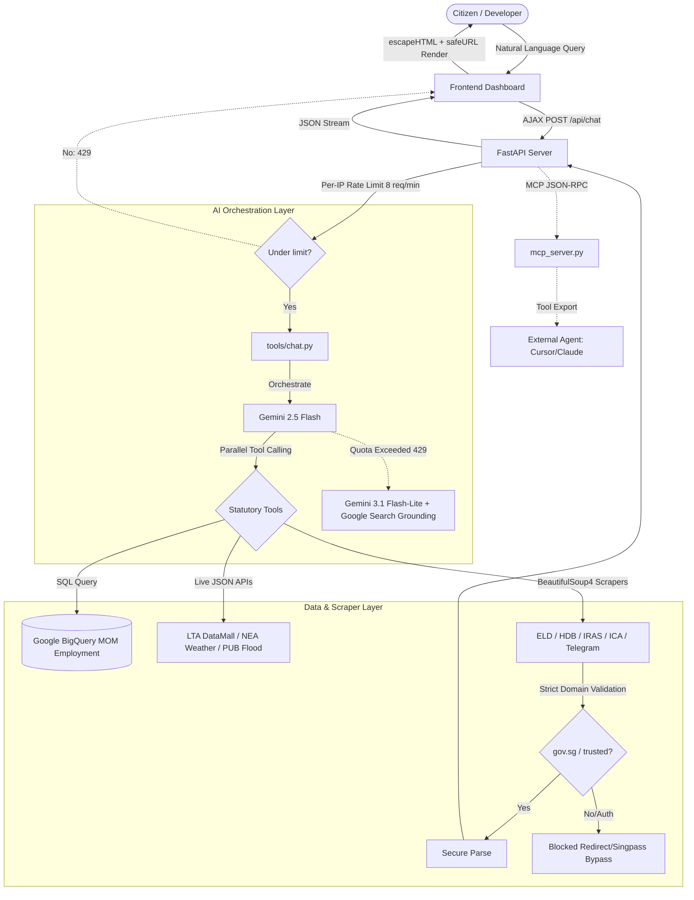

# 🇸🇬 MerlionOS: Unified Singapore Public Sector AI Coordination Brain
*APAC GenAI Academy (APAC Edition) — Cohort 2 Hackathon Project*

[](https://github.com/leshweyeewin/merlion-os/actions/workflows/ci.yml) [](https://github.com/leshweyeewin/merlion-os/actions/workflows/deploy.yml)

**🔗 Live Demo:** [merlion-os-648096114696.asia-southeast1.run.app](https://merlion-os-648096114696.asia-southeast1.run.app)  
*(Hosted on Google Cloud Run, region `asia-southeast1`, with a warm minimum instance — no cold-start wait.)*

---

## 🎯 What is MerlionOS & Why It Was Built

**MerlionOS** is a unified, secure, redirect-hardened Singapore public sector AI coordination brain and live dashboard. 

### The Problem
Singapore's digital public service landscape is highly advanced but fragmented across **81 distinct statutory boards and agencies** (CPF, IRAS, ELD, HDB, RedeemSG, SkillsFuture, HealthHub, ActiveSG, and more). A resident transition to full citizenship exposes a massive spike in administrative complexity—moving from basic tax filing (IRAS) to checking electoral registers (ELD), claiming CDC voucher tranches (RedeemSG), checking SkillsFuture credits, and navigating complex HDB BTO launches. Searching for these portal endpoints individually via search engines is inefficient, prone to malicious redirect hijacking, and lacks a centralized view.

### The Solution
MerlionOS aggregates this entire ecosystem into a single-pane-of-glass daily utility portal:
1. **Intelligent Co-Pilot**: Conversational agent that routes queries to 10+ backend tools to answer complex citizen questions.
2. **Live Data Dashboard (SG Hub)**: Consolidated parameters showing real-time MRT statuses (LTA DataMall), air quality/weather forecasts (NEA API), BTO launches (HDB press releases), and community deals.
3. **Operations Terminal**: Full transparency logs streaming raw SQL queries, crawler requests, and backend execution statuses in real time.

---

## 🏗️ Architecture & Process Flow



---

## 🚀 Key Technical Highlights

1. **Multi-Hop Agentic Tool Chaining**:
   - The Copilot doesn't just run tools once; it coordinates multi-turn reasoning loops. It executes a tool lookup (e.g., tech job wages), passes the results back to Gemini 2.5 Flash, and can choose to chain subsequent tool dispatches (e.g., SkillsFuture course suggestions) up to 3 hops before delivering a synthesized response.
2. **Multimodal Vision Document Uploads**:
   - Features a paperclip attachment button. Citizens can upload images or PDFs of CPF statements, IRAS tax notices, or official government letters. The system decodes and pipes the base64 bytes natively to Gemini's vision channel, extracting actionable parameters instantly.
3. **SSE Streaming Copilot & Cursor**:
   - Upgraded responses to a real-time Server-Sent Events (SSE) stream (`text/event-stream`). Answers appear progressively token-by-token with a blinking cursor (`▋`) that vanishes dynamically upon final completion.
4. **Google Search Grounding & Clickable Citations**:
   - Safe failover layer: if the primary Gemini API quota is hit (429), it falls back to `gemini-3.1-flash-lite` with Google Search Grounding. The response parses the grounding metadata to render clickable link pills (e.g. `[1] moh.gov.sg`) below the message bubble.
5. **Interactive Dashboards & Predictive Analytics**:
   - Integrates linear regression modules directly in Python to analyze and forecast HDB resale and COE premium trends. Maps key Singapore regions using Leaflet.js and displays live NEA weather popups.
6. **Operations Transparency Terminal**:
   - Live-streams raw BigQuery SQL, BeautifulSoup scraper networks, HTTP response status codes, and crawler logs directly to an active log terminal widget in the frontend.
7. **Shimmer Skeleton Loaders & Bookmarks**:
   - Replaced plain spinners with pulsing grey CSS skeleton blocks matching the tab cards. Added a gold star bookmarking system pinning compact clones of user-selected portals to a "My Matters" panel (persisted in `localStorage`).
8. **Rule-Based "Why" Explanations**:
   - Deterministic causal reasoning built entirely from data the app already fetches (no extra AI calls, no generated narrative): the Job Market panel cross-references the Hiring Pressure Index against the CAGR trend-break to distinguish genuine hiring demand from vacancy churn; COE Bidding compares quota vs. bid-volume to explain whether a premium move was a supply story, a demand story, or both; HDB Resale compares each flat type's own YoY move against the islandwide figure to flag a mix-shift vs. a broad-based price change. All three stay silent rather than force a guess when the signal is ambiguous.
9. **Structured-Data Architecture**:
   - Job vacancy, retrenchment, and COE bidding stats used to be computed once as Gemini-formatted text that the server then re-parsed with fragile line-splits for the dashboard. These now compute structured dicts consumed directly by the dashboard, with thin formatting wrappers rendering the same data into text for the chat/MCP tool — eliminating an entire class of "a wording tweak silently breaks the UI" bugs.
10. **Automated Deploy Pipeline, CI Lint Gate & 92-Test Suite**:
    - Automated Google Cloud Run build & deploy CI/CD pipeline (`deploy.yml`) triggered on branch push. CI runs a `pyflakes` lint gate (unused imports, undefined names) plus **92 unit tests** (routes, caching, structured stats, "why" explanations, XSS/`safeURL`, pydantic structures, OLS forecasts, allowlists) on every push.
11. **Chat Rate Limiting**:
    - Per-IP request caps (8/min, in-memory sliding window) on `/api/chat` and `/api/chat/stream`, so a single client can't drain the shared Gemini free-tier quota on the public demo link.
12. **Intent-Based Portal Search & Plain-English Glossary**:
    - A top-of-grid search box matches everyday phrasing ("top up CPF", "change company address") against a per-agency synonym map, not just each card's official name — plus quick-task chips and clickable suggestions that route to a live SG Hub panel when one answers the query better than a static portal link. Separately, ~26 government acronyms/jargon terms rendered anywhere in SG Hub get a dashed-underline tooltip (hover on desktop, tap on mobile) explaining them in plain English, applied automatically to newly-loaded panel content via a `MutationObserver`.
13. **Mobile Responsiveness**:
    - Dedicated breakpoints reflow the portal grid, directory toolbar, onboarding banner, header, and hub dashboard cards for narrow screens, with tap-based interaction (search chips, glossary/chart tooltips) replacing hover where a touchscreen has no hover state.


---

## 📑 Documentation Index

The repository's comprehensive guides are split into dedicated files inside [`docs/`](docs/) for modularity and clean maintenance:

| Topic | What's inside | File Link |
|---|---|---|
| 🏛️ **Statutory Portals Directory** | All **81** agency portals list, drag-and-drop ordering, and portal search/multi-select panels. | [docs/portals.md](docs/portals.md) |
| 📊 **Live Data Dashboard** | Detailed data sources and exact REST APIs for NEA weather, LTA transit, HDB listings, and Telegram feeds. | [docs/data_sources.md](docs/data_sources.md) |
| ⚖️ **IRAS Tax Relief Optimizer** | Progressive income tax brackets, CPF/SRS/Life-Insurance optimization logic, and the S$80k statutory relief cap. | [docs/iras_optimizer.md](docs/iras_optimizer.md) |
| 💻 **Local Setup & Quickstart** | Requirements, environment keys setup, Google Cloud BigQuery keys, and FastMCP daemon running instructions. | [docs/quickstart.md](docs/quickstart.md) |
| 🛡️ **Security & Performance** | Web scraping validation criteria, client-side escaping (`safeURL`), caching mechanisms, and GZip compression. | [docs/security_and_performance.md](docs/security_and_performance.md) |
| 📋 **Changelog** | Release notes and changes made in each version. | [docs/changelog.md](docs/changelog.md) |

---

## ⚡ Quick Start

For a detailed local setup walkthrough, Google BigQuery configuration, FastMCP agent tool servers, folder structure index, and troubleshooting, see the [Local Quickstart & Setup Guide](docs/quickstart.md).

### 1. Fast Setup
Copy `.env.example` to `.env` in the root folder and fill in your keys:
```env
GEMINI_API_KEY="YOUR_GEMINI_API_KEY"
LTA_DATAMALL_API_KEY="YOUR_LTA_DATAMALL_API_KEY"
```

### 2. Install & Run
Install core dependencies and start the uvicorn web server:
```bash
pip install -r requirements.txt
python server.py
```
Open **`http://127.0.0.1:8000/`** in your browser.

### 3. Run Tests
Ensure dependencies are installed, then run the lint gate and the python/javascript test suites (92 tests total):
```bash
pip install -r requirements-dev.txt
pyflakes server.py tools mcp_server.py tests
pytest tests/ -v
node --test tests/*.js
```

### 4. Build & Run Container (Docker)
```bash
docker build -t merlion-os .
docker run -p 8000:8000 --env-file .env merlion-os
```

