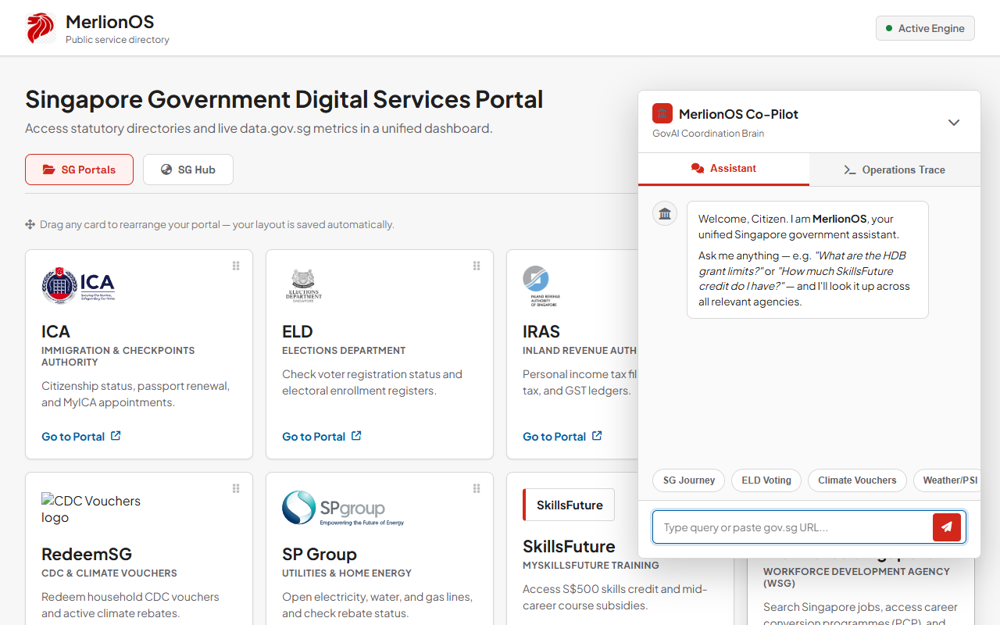
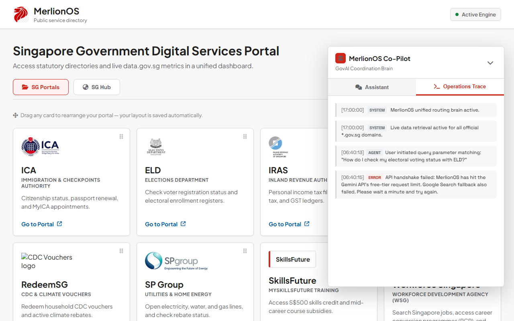

# 🇸🇬 MerlionOS: Unified Singapore Public Sector AI Coordination Brain
*APAC GenAI Academy (APAC Edition) — Cohort 2 Hackathon Project*

**🔗 Live Demo:** [merlion-os.onrender.com](https://merlion-os.onrender.com)
*(Hosted on Render's free tier — if the instance has spun down from inactivity, the first request can take ~30-60 seconds to wake up before the page loads.)*

---

## 🎯 Developer Intent & Project Motivation
I recently became a Singaporean citizen. Previously as a permanent resident, my digital interactions with the government were limited—I only ever needed to check **CPF**, file taxes with **IRAS**, and occasionally access **HealthHub**. 

However, upon receiving citizenship, I realized the vast landscape of statutory boards I now had to navigate: registering for compulsory voting with the **Elections Department (ELD)**, searching for housing with the **Housing & Development Board (HDB)**, claiming CDC tranches on **RedeemSG**, and checking learning credits on **MySkillsFuture**. 

Searching for these portals one-by-one via Google felt scattered and uncoordinated. While portals like *LifeSG* exist, they aren't fully accessible or comprehensive for all demographic needs. I built **MerlionOS** to act as a **one-stop government coordination portal** to unify this experience. 

Furthermore, as a working professional in Singapore, staying updated on **transport disruptions** and **employment/job market trends** is critical to my daily routine. Therefore, I consolidated live transit statuses and sector job metrics directly into the interface to create the ultimate daily utility portal.

---

## 🗺️ Live Data Dashboard & Exact Data Sources
All data panels in the **SG Hub Dashboard** load on-demand when clicked and show a **"Last synced"** SGT timestamp. Below are the exact sources and APIs feeding the UI:

| UI Sub-Panel | Data Source / API Endpoint | Display Details |
|---|---|---|
| 🌤️ **Weather & Air Quality** | **NEA API** (`https://api-open.data.gov.sg/v2/real-time/api/psi` & `/two-hr-forecast`) | Visual PSI gauge progress bar + 6-region 2-hour forecast emoji cards. |
| 🚇 **Transit & Rail Alerts** | **LTA DataMall API** (`https://datamall2.mytransport.sg/ltaodataservice/TrainServiceAlerts`) | Live line-by-line status grid (EWL, NSL, NEL, CCL, DTL, TEL, LRTs) with disruption logs, free public bus boarding notices, and free MRT shuttle routes. |
| 📢 **Gov Updates** | **Telegram Scraper** (7 Channels: `@govsg`, `@HealthHubSG`, `@scamshieldalert`, `@LTAsg`, `@NEAsg`, `@MOEsg`, `@GovTechSG`) | Last 3 posts per channel, sorted chronologically descending by SGT post date. |
| 🏢 **HDB BTO Tracker** | **HDB Pulse & Newsroom Scraper** (`https://www.hdb.gov.sg/hdb-pulse/news`) | Live BTO launch tables + BeautifulSoup HDB newsroom Next.js `__NEXT_DATA__` JSON extraction (resolving real CMS URLs dynamically). |
| 📊 **Job Market Analysis** | **Google BigQuery** (MOM Employment Dataset) | Vacancies, median starting salaries, top demanded skills, and industry trends partitioned by sector (Tech, Finance, Healthcare, General). |
| ⚠️ **MOM Retrenchment** | **MOM Advisory Index** | Active retrenchment numbers with Q1 2026 data freshness indicators. |
| 🎟️ **Kiasu SG Deals** | **Telegram Scraper** (15 Channels: `@confirmgood`, `@goodlobang`, `@kiasufoodies`, `@sgweekend`, `@moneydigest`, etc.) | Community deals and lifestyle news posted strictly within the last 24 hours, sorted newest-first. |

---

## 🏛️ Statutory Portals Directory
MerlionOS features a drag-and-drop reorderable grid representing all **15 statutory board portals** required for citizen life:
1. **ICA** (Immigration & Checkpoints Authority) — Passport, NRIC, Re-entry permits
2. **ELD** (Elections Department) — Voter registration & compulsory voting registers
3. **IRAS** (Inland Revenue Authority of Singapore) — Income tax & property tax filings
4. **CPF** (Central Provident Fund Board) — Retirement savings, MediSave, housing allocations
5. **MOM** (Ministry of Manpower) — Work passes, employment rules, labor laws
6. **MOH** (Ministry of Health / HealthHub) — Centralized electronic health records (NEHR)
7. **HDB** (Housing & Development Board) — BTO flat portals & housing grants
8. **MOE** (Ministry of Education) — Primary school registration & scholarships
9. **LTA** (Land Transport Authority / OneMotoring) — COE, road tax, vehicle licensing
10. **NEA** (National Environment Agency) — Air quality, weather alerts, public hygiene
11. **RedeemSG** — CDC voucher claims & Climate voucher redemptions
12. **SP Group** — Home electricity, water, and gas utilities setup
13. **MySkillsFuture** — Mid-career subsidies & course registries
14. **Gov.sg** — Budget announcements and key national policies
15. **WSG / SWDA** (Workforce Singapore) — Career conversion and job transition portals

*Layout orders are automatically persisted across sessions in browser `localStorage`.*

---

## 🤖 AI Co-Pilot & Security Hardening
The floating **Co-Pilot Chat Assistant** runs on **Gemini 2.5 Flash** with native parallel tool routing. It is hardened with enterprise-grade security layers:
* **Google Search Grounding Fallback:** If the primary Gemini 2.5 Flash API hits a 429 quota limit, the chat automatically fails-over to `gemini-3.1-flash-lite` with Google Search grounding to guarantee continuous response uptime.
* **XSS Sanitization (`safeURL`):** Client-side Javascript filters URLs starting with `javascript:`, `data:`, or `vbscript:` and escapes double/single quotes to prevent HTML attribute breakouts.
* **Redirection Verification:** The backend BeautifulSoup scraper follows redirect chains but validates that the final landing domain belongs to the `.gov.sg` domain or trusted public domains (`healthhub.sg`, `wsg.sg`, `cdc.gov.sg`). 
* **Auth Protection:** URLs matching authentication keywords (`singpass`, `login`, `signin`, `auth`, `corppass`) are blocked from scraping.

<p align="center">
  
  
</p>
<p align="center"><em>Left: the Assistant tab. Right: the Operations Trace tab, which exposes the routing brain's live decision log for auditability.</em></p>

---

## 💻 Local Quickstart

### 1. Project Dependencies
Ensure you are in the project root folder.
```bash
pip install -r requirements.txt
```

### 2. Set API Keys & Start Server
Set the required API keys (Gemini and LTA DataMall) in your environment variables.

**Windows PowerShell:**
```powershell
$env:GEMINI_API_KEY="YOUR_GEMINI_API_KEY"
$env:LTA_DATAMALL_API_KEY="YOUR_LTA_DATAMALL_API_KEY"
$env:PORT="8080"
python server.py
```

**Linux/macOS:**
```bash
export GEMINI_API_KEY="YOUR_GEMINI_API_KEY"
export LTA_DATAMALL_API_KEY="YOUR_LTA_DATAMALL_API_KEY"
export PORT="8080"
python server.py
```

Open your browser to: **`http://127.0.0.1:8080/`**
*(Note: If port 8000 is occupied on your machine, you can change the `PORT` env variable to run the server on any free port).*

A successful startup looks like this in your terminal:
```
INFO:     Started server process [16864]
INFO:     Waiting for application startup.
INFO:     Application startup complete.
INFO:     Uvicorn running on http://127.0.0.1:8080 (Press CTRL+C to quit)
INFO:     127.0.0.1:64638 - "GET / HTTP/1.1" 200 OK
INFO:     127.0.0.1:64638 - "GET /style.css HTTP/1.1" 200 OK
INFO:     127.0.0.1:64638 - "GET /app.js HTTP/1.1" 200 OK
```

### 3. Run FastMCP Tool Server
To load the statutory tools inside development agents (like Cursor or Claude Desktop):
```bash
python mcp_server.py
```
