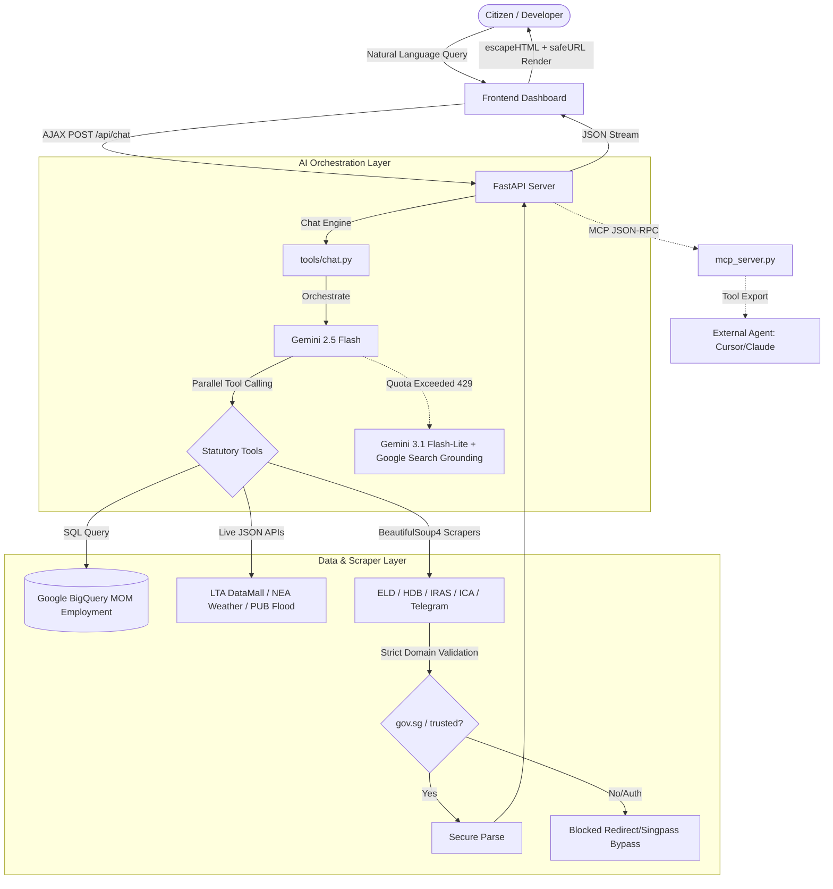

# 🇸🇬 MerlionOS: Unified Singapore Public Sector AI Coordination Brain
*APAC GenAI Academy (APAC Edition) — Cohort 2 Hackathon Project*

[](https://github.com/leshweyeewin/merlion-os/actions/workflows/ci.yml)

**🔗 Live Demo:** [merlion-os-648096114696.asia-southeast1.run.app](https://merlion-os-648096114696.asia-southeast1.run.app)  
*(Hosted on Google Cloud Run, region `asia-southeast1`, with a warm minimum instance — no cold-start wait.)*

---

## 🎯 What is MerlionOS & Why It Was Built

**MerlionOS** is a unified, secure, redirect-hardened Singapore public sector AI coordination brain and live dashboard. 

### The Problem
Singapore's digital public service landscape is highly advanced but fragmented across **81 distinct statutory boards and agencies** (CPF, IRAS, ELD, HDB, RedeemSG, SkillsFuture, HealthHub, ActiveSG, and more). A resident transition to full citizenship exposes a massive spike in administrative complexity—moving from basic tax filing (IRAS) to checking electoral registers (ELD), claiming CDC voucher tranches (RedeemSG), checking SkillsFuture credits, and navigating complex HDB BTO launches. Searching for these portal endpoints individually via search engines is inefficient, prone to malicious redirect hijacking, and lacks a centralized view.

### The Solution
MerlionOS aggregates this entire ecosystem into a single-pane-of-glass daily utility portal:
1. **Intelligent Co-Pilot**: Conversational agent that routes queries to 10+ backend tools to answer complex citizen questions.
2. **Live Data Dashboard (SG Hub)**: Consolidated parameters showing real-time MRT statuses (LTA DataMall), air quality/weather forecasts (NEA API), BTO launches (HDB press releases), and community deals.
3. **Operations Terminal**: Full transparency logs streaming raw SQL queries, crawler requests, and backend execution statuses in real time.

---

## 🏗️ Architecture & Process Flow



---

## 🚀 Key Technical Highlights

1. **Dual-Engine High-Availability AI**: 
   - **Primary Engine**: Google Gemini 2.5 Flash with parallel tool routing coordinates complex statutory queries.
   - **Resiliency Engine**: Dynamic automatic fallback to `gemini-3.1-flash-lite` with **Google Search Grounding** if the primary engine encounters a 429 API rate limit.
2. **Predictive Analytics (COE & HDB Linear Regression)**:
   - Integrates custom mathematical linear regression models directly in Python ([tools/transport.py](tools/transport.py) & [tools/housing.py](tools/housing.py)) that analyze the last 6 months of bidding rounds or flat sale records to forecast upcoming COE premiums and islandwide HDB median prices, rendering the forecast points directly on the dashboard's timeline charts.
3. **Geo-Spatial Interactive Mapping**:
   - Integrates a responsive Leaflet.js map layer within the Environment card. It maps geographic coordinates of key planning areas across Singapore (Woodlands, Punggol, Tampines, Orchard, etc.) and visualises live 2-hour NEA weather forecasts using custom popup forecast markers.
4. **Analytical BigQuery Warehouse Integration**:
   - Directly queries partitioned Google BigQuery databases containing Ministry of Manpower (MOM) employment and occupational wage datasets, computing dynamic statistics and wage percentiles in real time.
5. **FastMCP Server Integration**:
   - Added `mcp_server.py` to expose all statutory board tools natively via the Model Context Protocol (MCP) JSON-RPC, allowing developers to plug MerlionOS directly into IDE agents like Cursor or Claude Desktop.
6. **Operations Terminal (Transparency Console)**:
   - Eliminates the AI "black box" by live-streaming raw SQL queries, BeautifulSoup scraper network actions, HTTP response status codes, and crawler logs directly to a dedicated console widget in the UI.
7. **Strict Security & Scraper Hardening**:
   - Restricts BeautifulSoup crawlers strictly to `.gov.sg` and validated trusted domains (`healthhub.sg`, `wsg.sg`, `cdc.gov.sg`), auto-blocking any redirect to commercial domains or Singpass login interfaces.
   - Custom client-side XSS protection via `safeURL` validation and strict HTML string escaping prevents link injection and security exploits.

---

## 📑 Documentation Index

The repository's comprehensive guides are split into dedicated files inside [`docs/`](docs/) for modularity and clean maintenance:

| Topic | What's inside | File Link |
|---|---|---|
| 🏛️ **Statutory Portals Directory** | All **81** agency portals list, drag-and-drop ordering, and portal search/multi-select panels. | [docs/portals.md](docs/portals.md) |
| 📊 **Live Data Dashboard** | Detailed data sources and exact REST APIs for NEA weather, LTA transit, HDB listings, and Telegram feeds. | [docs/data_sources.md](docs/data_sources.md) |
| ⚖️ **IRAS Tax Relief Optimizer** | Progressive income tax brackets, CPF/SRS/Life-Insurance optimization logic, and the S$80k statutory relief cap. | [docs/iras_optimizer.md](docs/iras_optimizer.md) |
| 💻 **Local Setup & Quickstart** | Requirements, environment keys setup, Google Cloud BigQuery keys, and FastMCP daemon running instructions. | [docs/quickstart.md](docs/quickstart.md) |
| 🛡️ **Security & Performance** | Web scraping validation criteria, client-side escaping (`safeURL`), caching mechanisms, and GZip compression. | [docs/security_and_performance.md](docs/security_and_performance.md) |
| 📋 **Changelog** | Release notes and changes made in each version. | [docs/changelog.md](docs/changelog.md) |

---

## ⚡ Quick Start

### 1. Installation
Install the project dependencies inside a python virtual environment:
```bash
pip install -r requirements.txt
```

### 2. Configure Environment Variables
Create a `.env` file in the project root with the following keys:
```bash
# Required
GEMINI_API_KEY="YOUR_GEMINI_API_KEY"
LTA_DATAMALL_API_KEY="YOUR_LTA_DATAMALL_API_KEY"

# Optional — data.gov.sg APIs work unauthenticated, but adding this key lifts
# the rate limit so NEA weather/PSI calls skip the 1-second pacing delay.
DATA_GOV_SG_API_KEY="YOUR_DATA_GOV_SG_API_KEY"

# Optional — enables BigQuery-backed job vacancy queries (faster, pre-loaded).
# Without these, the server falls back to live data.gov.sg fetches automatically.
GCP_PROJECT_ID="YOUR_GCP_PROJECT_ID"
GOOGLE_APPLICATION_CREDENTIALS="./service-account-key.json"
```

> **PowerShell users:** To set env vars temporarily in a session use `$env:KEY = "value"`, not `KEY="value"` (that's bash syntax).

### 3. Run the Server
Launch the FastAPI production-ready server:
```bash
python server.py
```
Open **`http://127.0.0.1:8080/`** in your browser. For advanced features (BigQuery, FastMCP) and running the test suite, check out [docs/quickstart.md](docs/quickstart.md).
