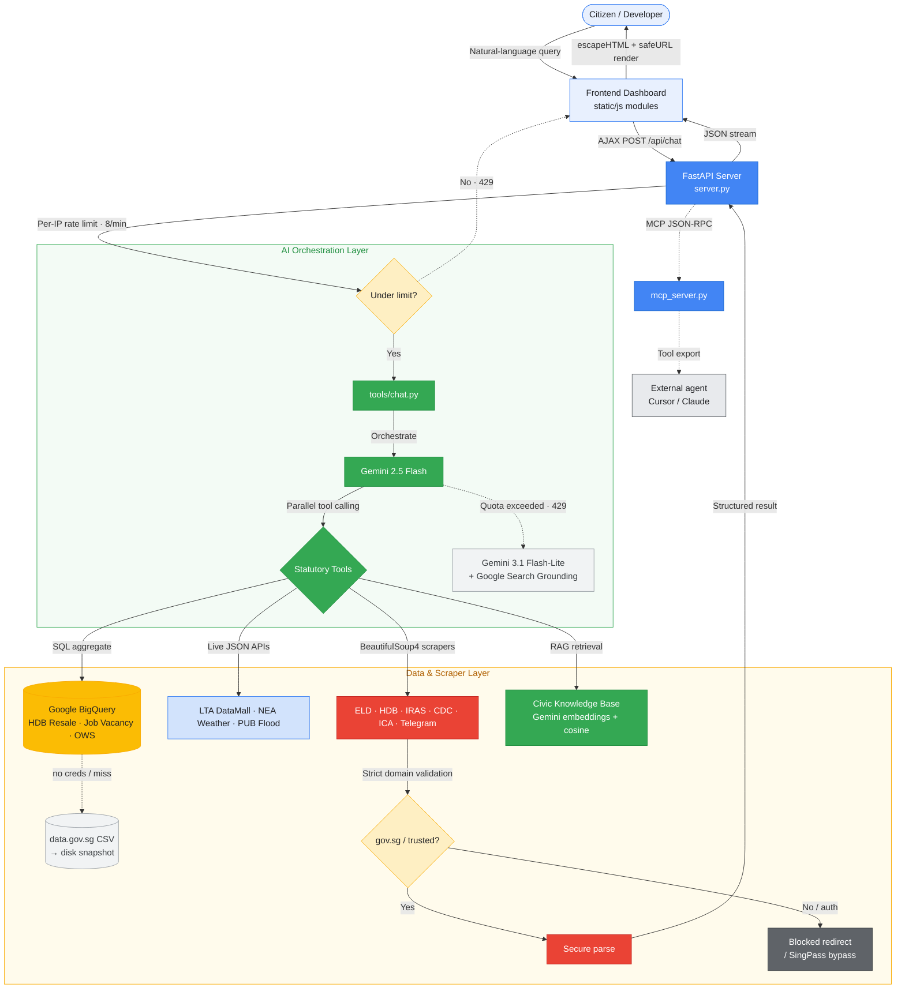

# 🇸🇬 MerlionOS: Unified Singapore Public Sector AI Coordination Brain
*APAC GenAI Academy (APAC Edition) — Cohort 2 Hackathon Project*

[](https://github.com/leshweyeewin/merlion-os/actions/workflows/ci.yml)

**🔗 Live Demo:** [merlion-os.onrender.com](https://merlion-os.onrender.com)  
*(Hosted on Render. Singapore government sites — LTA DataMall, the HDB newsroom, MOM's wage
tables — WAF-block cloud datacenter IP ranges, and Google Cloud Run's egress falls inside those
blocks, so those live feeds 403 from GCP. Render's AWS-based egress isn't blocked, so all feeds
fetch live there. A Google Cloud Run backup deploy still exists (`deploy.yml`, manual-only) but
serves cached/seed fallbacks for the WAF-blocked sources.)*

---

## 🎯 What is MerlionOS & Why It Was Built

**MerlionOS** is a unified, secure, redirect-hardened Singapore public sector AI coordination brain and live dashboard. 

### The Problem
Singapore's digital public service landscape is highly advanced but fragmented across **81 distinct statutory boards and agencies** (CPF, IRAS, ELD, HDB, RedeemSG, SkillsFuture, HealthHub, ActiveSG, and more). A resident transition to full citizenship exposes a massive spike in administrative complexity—moving from basic tax filing (IRAS) to checking electoral registers (ELD), claiming CDC voucher tranches (RedeemSG), checking SkillsFuture credits, and navigating complex HDB BTO launches. Searching for these portal endpoints individually via search engines is inefficient, prone to malicious redirect hijacking, and lacks a centralized view.

### The Solution
MerlionOS aggregates this entire ecosystem into a single-pane-of-glass daily utility portal:
1. **Intelligent Co-Pilot**: Conversational agent that routes queries to 15 backend tools — including a retrieval-augmented civic knowledge base — to answer complex citizen questions, optionally tailored to a chosen demo persona.
2. **Live Data Dashboard (SG Hub)**: Consolidated parameters showing real-time MRT statuses (LTA DataMall), air quality/weather forecasts (NEA API), BTO launches (HDB press releases), and community deals.
3. **Operations Terminal**: Full transparency logs streaming raw SQL queries, crawler requests, and backend execution statuses in real time.

---

## 🏗️ Architecture & Process Flow


```mermaid
graph TD
    User([Citizen / Developer]):::client -->|Natural-language query| UI[Frontend Dashboard<br/>static/js modules]:::client
    UI -->|AJAX POST /api/chat| Server[FastAPI Server<br/>server.py]:::server
    Server -->|Per-IP rate limit · 8/min| RateLimit{Under limit?}:::gate
    RateLimit -.->|No · 429| UI

    subgraph AI["AI Orchestration Layer"]
        RateLimit -->|Yes| Chat[tools/chat.py]:::ai
        Chat -->|Orchestrate| Gemini[Gemini 2.5 Flash]:::ai
        Gemini -->|Parallel tool calling| Tools{Statutory Tools}:::ai
        Gemini -.->|Quota exceeded · 429| Fallback[Gemini 3.1 Flash-Lite<br/>+ Google Search Grounding]:::fallback
    end

    subgraph DATA["Data &amp; Scraper Layer"]
        Tools -->|SQL aggregate| BQ[(Google BigQuery<br/>HDB Resale · Job Vacancy · OWS)]:::data
        BQ -.->|no creds / miss| GOV[(data.gov.sg CSV<br/>→ disk snapshot)]:::fallback
        Tools -->|Live JSON APIs| APIS[LTA DataMall · NEA Weather · PUB Flood]:::api
        Tools -->|BeautifulSoup4 scrapers| Scrapers[ELD · HDB · IRAS · CDC · ICA · Telegram]:::scraper
        Tools -->|RAG retrieval| KB[Civic Knowledge Base<br/>Gemini embeddings + cosine]:::ai
        Scrapers -->|Strict domain validation| Validate{gov.sg / trusted?}:::gate
        Validate -->|Yes| Fetch[Secure parse]:::scraper
        Validate -->|No / auth| Block[Blocked redirect<br/>/ SingPass bypass]:::security
    end

    Fetch -->|Structured result| Server
    Server -->|JSON stream| UI
    UI -->|escapeHTML + safeURL render| User
    Server -.->|MCP JSON-RPC| FastMCP[mcp_server.py]:::server
    FastMCP -.->|Tool export| Cursor[External agent<br/>Cursor / Claude]:::external

    classDef client fill:#E8F0FE,stroke:#4285F4,stroke-width:1px,color:#202124;
    classDef server fill:#4285F4,stroke:#1967D2,stroke-width:1px,color:#ffffff;
    classDef ai fill:#34A853,stroke:#1E8E3E,stroke-width:1px,color:#ffffff;
    classDef data fill:#FBBC04,stroke:#F9AB00,stroke-width:1px,color:#202124;
    classDef api fill:#D2E3FC,stroke:#4285F4,stroke-width:1px,color:#202124;
    classDef scraper fill:#EA4335,stroke:#C5221F,stroke-width:1px,color:#ffffff;
    classDef security fill:#5F6368,stroke:#3C4043,stroke-width:1px,color:#ffffff;
    classDef gate fill:#FEEFC3,stroke:#F9AB00,stroke-width:1px,color:#202124;
    classDef fallback fill:#F1F3F4,stroke:#9AA0A6,stroke-width:1px,color:#3C4043;
    classDef external fill:#E8EAED,stroke:#5F6368,stroke-width:1px,color:#202124;

    style AI fill:#F3FBF5,stroke:#34A853,stroke-width:1px,color:#1E8E3E;
    style DATA fill:#FFFBEC,stroke:#F9AB00,stroke-width:1px,color:#B06000;
```

---

## 🚀 Key Technical Highlights

1. **Multi-Hop Agentic Tool Chaining**:
   - The Copilot doesn't just run tools once; it coordinates multi-turn reasoning loops. It executes a tool lookup (e.g., tech job wages), passes the results back to Gemini 2.5 Flash, and can choose to chain subsequent tool dispatches (e.g., SkillsFuture course suggestions) up to 3 hops before delivering a synthesized response.
2. **Multimodal Vision Document Uploads**:
   - Features a paperclip attachment button. Citizens can upload images or PDFs of CPF statements, IRAS tax notices, or official government letters. The system decodes and pipes the base64 bytes natively to Gemini's vision channel, extracting actionable parameters instantly.
3. **SSE Streaming Copilot & Cursor**:
   - Upgraded responses to a real-time Server-Sent Events (SSE) stream (`text/event-stream`). Answers appear progressively token-by-token with a blinking cursor (`▋`) that vanishes dynamically upon final completion.
4. **Google Search Grounding & Clickable Citations**:
   - Safe failover layer: if the primary Gemini API quota is hit (429), it falls back to `gemini-3.1-flash-lite` with Google Search Grounding. The response parses the grounding metadata to render clickable link pills (e.g. `[1] moh.gov.sg`) below the message bubble.
5. **Interactive Dashboards & Predictive Analytics**:
   - Integrates linear regression modules directly in Python to analyze and forecast HDB resale and COE premium trends. Plots live taxi availability near the user on an interactive Leaflet.js map (the "Around You" feature); NEA weather is shown as a live PSI gauge with 6-region forecast cards.
5a. **BigQuery-Backed Big Datasets (3-Tier, WAF-Proof)**:
   - The three large tabular datasets — **HDB Resale** (236k+ rows), **MOM Job Vacancy**, and the **MOM Occupational Wage Survey** — are hosted in Google BigQuery (loaded via `scripts/load_*_to_bigquery.py`) and answered with server-side aggregate queries (`APPROX_QUANTILES` medians, `GROUP BY` roll-ups) instead of downloading multi-MB CSV/Excel per request. Each falls back cleanly: **BigQuery → data.gov.sg / live source → committed seed/disk snapshot**, so a host without GCP credentials (or a WAF that 403s the origin) degrades to the next tier rather than failing. Results are memoised for hours since the data is monthly-static, and a startup pre-warm thread means the first visitor never pays the cold query.
6. **Operations Transparency Terminal**:
   - Live-streams raw BigQuery SQL, BeautifulSoup scraper networks, HTTP response status codes, and crawler logs directly to an active log terminal widget in the frontend.
7. **Considered Loading States & Bookmarks**:
   - Loading UX is tuned so a fetch reads as *working*, not *lagging*. SG Hub panels show static grey skeleton blocks shaped like the real cards, with a slim indeterminate progress bar (one continuous sweep) along the top of the pane while its data streams in. The Co-Pilot's waiting state is a shimmering status line that names the actual step in flight — "Searching the knowledge base", "Reading gov.sg pages", "Searching the web" — driven by the real tool `log` events the backend streams, replacing the old bouncing-dots typing indicator. That per-stage status is honest because the chat pipeline genuinely runs those tools; the single-fetch Hub panes deliberately use the neutral progress bar instead of a per-step checklist, to avoid signalling steps that don't actually happen client-side. Respects `prefers-reduced-motion`. Also a gold star bookmarking system pinning compact clones of user-selected portals to a "My Matters" panel (persisted in `localStorage`).
8. **Rule-Based "Why" Explanations**:
   - Deterministic causal reasoning built entirely from data the app already fetches (no extra AI calls, no generated narrative): the Job Market panel cross-references the Hiring Pressure Index against the CAGR trend-break to distinguish genuine hiring demand from vacancy churn; COE Bidding compares quota vs. bid-volume to explain whether a premium move was a supply story, a demand story, or both; HDB Resale compares each flat type's own YoY move against the islandwide figure to flag a mix-shift vs. a broad-based price change. All three stay silent rather than force a guess when the signal is ambiguous.
9. **Structured-Data Architecture**:
   - Job vacancy, retrenchment, and COE bidding stats used to be computed once as Gemini-formatted text that the server then re-parsed with fragile line-splits for the dashboard. These now compute structured dicts consumed directly by the dashboard, with thin formatting wrappers rendering the same data into text for the chat/MCP tool — eliminating an entire class of "a wording tweak silently breaks the UI" bugs.
10. **CI, Hourly Seed Refresh & 150-Test Suite**:
    - **Deploy:** the canonical demo auto-deploys to **Render** on every push to `main` (Render's GitHub integration). A Google Cloud Run pipeline (`deploy.yml`) is retained as a manual-only cold backup. CI runs a `pyflakes` lint gate (unused imports, undefined names) plus **144 Python + 6 JavaScript unit tests** (routes, caching, the shared data.gov.sg fetch/cache loader, structured stats, "why" explanations, RAG retrieval, XSS/`safeURL`, pydantic structures, OLS forecasts, allowlists).
    - **Hourly seed refresh (`refresh-seeds.yml`):** re-scrapes the WAF-sensitive `.gov.sg` sources (HDB newsroom, MOM OWS) from a GitHub runner and commits the refreshed `data_seed/*.json` only when the underlying data changes, so the shipped fallback seeds never drift stale; the commit is picked up by Render's auto-deploy. (These seeds are now the *last* fallback tier — BigQuery and the live sources are tried first — but stay committed so the app still renders on a fresh host before any BigQuery load.)
11. **Chat Rate Limiting**:
    - Per-IP request caps (8/min, in-memory sliding window) on `/api/chat` and `/api/chat/stream`, so a single client can't drain the shared Gemini free-tier quota on the public demo link.
12. **Intent-Based Portal Search & Plain-English Glossary**:
    - A top-of-grid search box matches everyday phrasing ("top up CPF", "change company address") against a per-agency synonym map, not just each card's official name — plus quick-task chips and clickable suggestions that route to a live SG Hub panel when one answers the query better than a static portal link. A **Sort A–Z** toolbar button re-orders the whole grid alphabetically by agency name (persisted like a manual drag-reorder), as a one-click alternative to hunting through a custom layout. Separately, ~26 government acronyms/jargon terms rendered anywhere in SG Hub get a dashed-underline tooltip (hover on desktop, tap on mobile) explaining them in plain English, applied automatically to newly-loaded panel content via a `MutationObserver`.
13. **Mobile Responsiveness**:
    - Dedicated breakpoints reflow the portal grid, directory toolbar, onboarding banner, header, and hub dashboard cards for narrow screens, with tap-based interaction (search chips, glossary/chart tooltips) replacing hover where a touchscreen has no hover state.
14. **RAG Civic Knowledge Base**:
    - A retrieval-augmented tool (`tools/knowledge.py`) grounds open-ended policy/eligibility questions the 14 agency tools don't specifically cover (e.g. "BTO vs resale", "how CPF LIFE works", "who must file income tax"). A curated 42-chunk corpus of authoritative civic facts is embedded with Gemini `gemini-embedding-001` (768-dim, retrieval task types), cached to `.data_cache/` by a corpus fingerprint, and retrieved via pure-Python cosine similarity. Registered in the tool loop as `search_knowledge_base`, so the agent retrieves-then-cites official source URLs instead of relying on parametric memory — and degrades gracefully if the embedding API is unavailable.
15. **Demo Personalization (Personas)**:
    - A demo persona selector (New citizen / Young family / Fresh graduate / Retiree — no real SingPass or identity data) tailors the experience across three surfaces: the Co-Pilot receives life-stage context so answers are prioritised for that person, the SG Portals grid surfaces a "Personalized for X" banner of the most relevant agencies, and the SG Hub shows a "Recommended dashboards" banner jumping to the data views that matter for that life-stage. Fully deterministic, persisted in `localStorage`.
16. **Live-Data Freshness Badges & Fetch Resilience**:
    - Scraper-backed panels (ICA, IRAS, HDB Newsroom, Telegram feeds) return a `data_status` marker so the UI shows a green **"Live"** pill on success and an amber **"Showing last known data"** pill when a source falls back to cache/sample — a flaky upstream degrades visibly rather than silently. SG Hub tab fetches also auto-retry with exponential backoff (2 retries) before surfacing an error, smoothing first-load flakiness while the server pre-warms. When a fetch still fails, the Jobs pane (the slowest, BigQuery/MOM-backed source) renders an inline **Retry** button rather than a dead-end message. On the server side, when a live download fails, the expired disk snapshot that's served in its place is re-cached as *fresh* — so a slow, failing upstream isn't re-hit on every subsequent request (including the sibling fetches within the same endpoint) until its TTL lapses.
17. **Modular Front-End**:
    - The former ~3.9k-line `static/app.js` is split into six focused modules under `static/js/` (`utils`, `tax`, `persona`, `portals`, `chat`, `hub`), loaded in dependency order — improving readability and maintainability with no behavioural change.
18. **Keyboard-Accessible SG Hub Tabs**:
    - The SG Hub sub-tab bar is exposed as a proper ARIA `tablist` with a roving `tabindex` and full keyboard navigation: `←`/`→` cycle through sections (wrapping), `Home`/`End` jump to the first/last, and each pane is wired up as a labelled `tabpanel`. Semantics and keyboard support only — the bar keeps its existing `flex-wrap` layout, reflowing onto a second row on narrow viewports rather than scrolling.
19. **Concurrent Fetches & Response Caching**:
    - The HDB pane loads its three independent sources — BTO/grant tables, the newsroom scrape, and the resale dataset — concurrently in an `anyio` task group, so the pane appears in the time of the slowest source instead of their sum. Repeat clicks and sector-tab switches on the Jobs pane are served from a short (5-min) per-sector response cache over rows that are already cached upstream, making them instant instead of recomputing each time; the slow HDB newsroom scrape gets its own 30-min cache. Data-fetch plumbing is centralised: all four data.gov.sg dataset downloads share one `_fetch_datagovsg_csv_rows` helper, and the three with a disk-snapshot tier share one `_cached_rows` memory→disk→network loader (`tools/core.py`), each covered directly by tests.


---

## 📑 Documentation Index

The repository's comprehensive guides are split into dedicated files inside [`docs/`](docs/) for modularity and clean maintenance:

| Topic | What's inside | File Link |
|---|---|---|
| 🏛️ **Statutory Portals Directory** | All **81** agency portals list, drag-and-drop ordering, and portal search/multi-select panels. | [docs/portals.md](docs/portals.md) |
| 📊 **Live Data Dashboard** | Detailed data sources and exact REST APIs for NEA weather, LTA transit, HDB listings, and Telegram feeds. | [docs/data_sources.md](docs/data_sources.md) |
| ⚖️ **IRAS Tax Relief Optimizer** | Progressive income tax brackets, CPF SA (RSTU) vs. SRS top-up optimization, itemised pre-existing reliefs (incl. life insurance), and the S$80k statutory relief cap. | [docs/iras_optimizer.md](docs/iras_optimizer.md) |
| 💻 **Local Setup & Quickstart** | Requirements, environment keys setup, Google Cloud BigQuery keys, and FastMCP daemon running instructions. | [docs/quickstart.md](docs/quickstart.md) |
| 🛡️ **Security & Performance** | Web scraping validation criteria, client-side escaping (`safeURL`), caching mechanisms, and GZip compression. | [docs/security_and_performance.md](docs/security_and_performance.md) |
| 📋 **Changelog** | Release notes and changes made in each version. | [docs/changelog.md](docs/changelog.md) |

---

## ⚡ Quick Start

For a detailed local setup walkthrough, Google BigQuery configuration, FastMCP agent tool servers, folder structure index, and troubleshooting, see the [Local Quickstart & Setup Guide](docs/quickstart.md).

### 1. Fast Setup
Copy `.env.example` to `.env` in the root folder and fill in your keys:
```env
GEMINI_API_KEY="YOUR_GEMINI_API_KEY"
LTA_DATAMALL_API_KEY="YOUR_LTA_DATAMALL_API_KEY"
```

### 2. Install & Run
Install core dependencies and start the uvicorn web server:
```bash
pip install -r requirements.txt
python server.py
```
Open **`http://127.0.0.1:8000/`** in your browser.

### 3. Run Tests
Ensure dependencies are installed, then run the lint gate and the python/javascript test suites (144 Python + 6 JavaScript tests):
```bash
pip install -r requirements-dev.txt
pyflakes server.py tools mcp_server.py tests
pytest tests/ -v
node --test tests/*.js
```

### 4. Build & Run Container (Docker)
```bash
docker build -t merlion-os .
docker run -p 8000:8000 --env-file .env merlion-os
```

