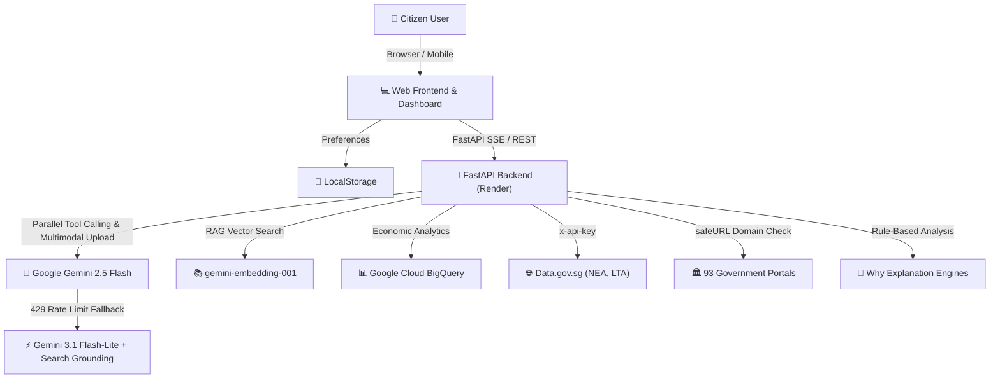
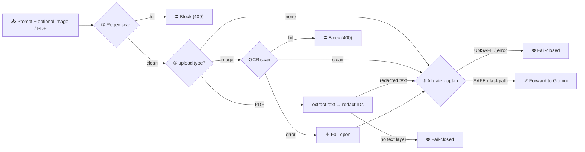
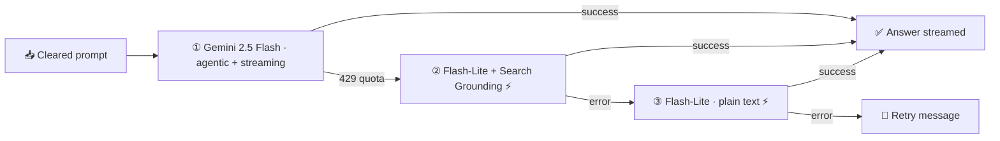

# 🇸🇬 MerlionOS: Unified Singapore Public Sector AI Coordination Brain
*APAC GenAI Academy (APAC Edition) — Cohort 2 Hackathon Project*

[](https://github.com/leshweyeewin/merlion-os/actions/workflows/ci.yml)

**🔗 Live Demo:** [merlion-os.onrender.com](https://merlion-os.onrender.com)  
**📝 Read the Dev Journey:** [Building MerlionOS (Blog Post)](https://blog.pancherry.com/merlion-os/)  
*(Hosted on Render. Singapore government sites — LTA DataMall, the HDB newsroom, MOM's wage
tables — WAF-block cloud datacenter IP ranges, and Google Cloud Run's egress falls inside those
blocks, so those live feeds 403 from GCP. Render's AWS-based egress isn't blocked, so all feeds
fetch live there. A Google Cloud Run backup deploy still exists (`deploy.yml`, manual-only) but
serves cached/seed fallbacks for the WAF-blocked sources.)*

---

## 🎯 What is MerlionOS & Why It Was Built

**MerlionOS** is a unified, secure, redirect-hardened Singapore public sector AI coordination brain and live dashboard. 

### The Problem
Singapore's digital public service landscape is highly advanced but fragmented across **93 distinct public sector portals and agencies** (CPF, IRAS, ELD, HDB, RedeemSG, GovBenefits, SkillsFuture, HealthHub, ActiveSG, ROM, CSA, AIC, MUIS, SportSG, PDPC, CNB, SPS, TADM, TAFEP, and more). A resident transition to full citizenship exposes a massive spike in administrative complexity—moving from basic tax filing (IRAS) to checking electoral registers (ELD), claiming CDC voucher tranches (RedeemSG), checking cash benefits (GovBenefits), checking SkillsFuture credits, and navigating complex HDB BTO launches. Searching for these portal endpoints individually via search engines is inefficient, prone to malicious redirect hijacking, and lacks a centralized view.

### The Solution
MerlionOS aggregates this entire ecosystem into a single-pane-of-glass daily utility portal:
1. **Intelligent Co-Pilot**: Conversational agent that routes queries to 15 backend tools — including a retrieval-augmented civic knowledge base and multimodal screenshot/notice analysis — to answer complex citizen questions, optionally tailored to a chosen demo persona.
2. **Live Data Dashboard (SG Hub)**: Consolidated parameters showing real-time MRT statuses (LTA DataMall), 2km taxi density map, air quality/weather forecasts (NEA API), BTO launches (HDB press releases), IRAS tax relief optimizer, and community deals.
3. **Operations Terminal**: Full transparency logs streaming raw SQL queries, crawler requests, and backend execution statuses in real time.

---

## 🏗️ Architecture & Process Flow


```mermaid
flowchart TD
    User["👤 Citizen User"] -->|Browser / Mobile| FE["💻 Web Frontend & Dashboard"]
    FE -->|Preferences| LocalStorage["💾 LocalStorage"]
    FE -->|FastAPI SSE / REST| API["🚀 FastAPI Backend (Render)"]

    API -->|Parallel Tool Calling & Multimodal Upload| Gemini["🤖 Google Gemini 2.5 Flash"]
    API -->|RAG Vector Search| Embed["📚 gemini-embedding-001"]
    Gemini -->|429 Rate Limit Fallback| FlashLite["⚡ Gemini 3.1 Flash-Lite + Search Grounding"]

    API -->|Economic Analytics| BQ["📊 Google Cloud BigQuery"]
    API -->|x-api-key| DataGov["🌐 Data.gov.sg (NEA, LTA)"]
    API -->|safeURL Domain Check| GovPortals["🏛️ 93 Government Portals"]
    API -->|Rule-Based Analysis| WhyEngines["🎯 Why Explanation Engines"]
```

---

## 🛡️ Security & Resilience — Two Views

Two decisions define how MerlionOS behaves under pressure: **how it protects citizen data** and **how it stays up when the AI does not.** Both are deliberate, layered, and fail in a chosen direction rather than by accident.

### 1. Privacy Guardrail — defense-in-depth, *block-don't-redact*

Personal identifiers are stopped **before any bytes reach the LLM**. Detection is layered so no single check is a single point of failure, and each layer fails in the direction that does the least harm.


```mermaid
flowchart LR
    In["📥 Prompt + optional image / PDF"] --> L1{"① Regex scan"}
    L1 -->|hit| B1["⛔ Block (400)"]
    L1 -->|clean| T{"② upload type?"}
    T -->|image| OCR{"OCR scan"}
    T -->|PDF| RX["extract text → redact IDs"]
    T -->|none| L3
    OCR -->|hit| B2["⛔ Block (400)"]
    OCR -->|error| FO["⚠️ Fail-open"]
    OCR -->|clean| L3{"③ AI gate · opt-in"}
    RX -->|no text layer| B4["⛔ Fail-closed"]
    RX -->|redacted text| L3
    FO --> L3
    L3 -->|UNSAFE / error| B3["⛔ Fail-closed"]
    L3 -->|SAFE / fast-path| OK["✅ Forward to Gemini"]
```

**Why this is a good design**
- **Defense-in-depth, not one regex.** Layer 1 catches the concrete Singapore formats before data leaves the server; Layer 2 extends the *same* rules to uploaded screenshots via OCR; Layer 3 adds optional semantic coverage for paraphrased attempts regex can't see.
- **Block image bytes; redact PDF text.** Images reach the vision channel as raw bytes you can't reliably scrub, so a detected identifier **blocks** the upload. PDFs are handled differently: the text layer is extracted server-side, personal identifiers are **deterministically redacted to `[REDACTED]`**, and only that cleaned text — never the file — is forwarded. Redaction is used precisely where we control exactly what's sent *and* blocking would defeat the feature: every official NOA / CPF statement / HDB letter carries the citizen's NRIC, so block-don't-redact would make real documents un-uploadable. Dollar figures (assessable income, grant sums) are preserved so the document stays worth analysing.
- **Deliberately opposite fail postures.** Image OCR failure **fails open** (a legit NOA photo shouldn't be blocked by a Tesseract hiccup — the model's own vision safety still applies); a PDF with no extractable text (a scan) **fails closed** — we won't forward a document we couldn't read and redact, and point the user to image upload instead; the auth/credential AI gate **fails closed** too. Each direction is a decision, documented in code.
- **Luhn-gated card detection.** The card regex intentionally over-matches any 13–19 digit run, then a Luhn checksum rejects false positives (order IDs, reference numbers) while still catching real PANs.
- **Cheap by default.** A local `is_obviously_safe` fast-path + result cache means everyday conversational queries never pay for an AI call — and the AI gate ships **off** (see note below).

> **On the opt-in AI gate:** it is off by default *on purpose*. It is **fail-closed**, so during a primary-model 429 (the exact case the failover ladder below is built to survive) it would instead block harmless prompts with a security error. Enable it only for controlled demos of the semantic layer, ideally with a dedicated API key so chat traffic can't starve it.

### 2. AI Chat Failover Ladder — graceful degradation, never a dead end

When the primary model is rate-limited, the assistant steps down through progressively simpler modes instead of failing — and tells the user honestly which mode produced the answer.


```mermaid
flowchart LR
    Q["📥 Cleared prompt"] --> T1["① Gemini 2.5 Flash · agentic + streaming"]
    T1 -->|success| Done["✅ Answer streamed"]
    T1 -->|429 quota| T2["② Flash-Lite + Search Grounding ⚡"]
    T2 -->|success| Done
    T2 -->|error| T3["③ Flash-Lite · plain text ⚡"]
    T3 -->|success| Done
    T3 -->|error| T4["🛟 Retry message"]
```

**Why this is a good design**
- **No dead ends.** Four tiers mean a single quota spike degrades the *quality* of the answer, not the *availability* of the service.
- **Degrades capability in the right order.** Full agentic tool-calling → search-grounded → plain text → a friendly retry message; each step trades a capability for resilience.
- **Honest by design.** Tiers 2 and 3 append a visible **⚡ Fallback / Failover Mode** note so users know when an answer came from a reduced path, rather than silently returning lower-fidelity results.
- **Streaming-safe.** The same ladder exists in both the buffered (`run_chat_loop`) and SSE-streaming (`run_chat_stream`) paths, and the final error tier emits an empty token first so a chat bubble exists before the error renders (no blank "no answer" gap).

*(Both diagrams are mirrored in [`docs/architecture_diagram.md`](docs/architecture_diagram.md) — keep the copies in sync.)*

---

## 🚀 Key Technical Highlights

**🤖 AI & Agentic Core**
* **Primary Engine (Gemini 2.5 Flash):** The default high-speed reasoning core powering the agent.
* **Multi-Hop Reasoning:** The Co-Pilot orchestrates multi-turn reasoning loops—querying APIs, analyzing results, and deciding next steps before synthesizing a final answer.
* **Multimodal Vision:** Reads an uploaded photo of a government notice/letter or a screenshot of a public gov page via Gemini's vision channel — surfacing the required action, deadline, and eligibility, and cross-referencing statutory caps. For **images**, by policy it refuses to extract NRIC/FIN/passport numbers, prompting the user to redact identifiers first. **PDF documents** (an IRAS NOA, CPF statement or HDB letter) can be uploaded directly: their text layer is extracted and personal identifiers are auto-redacted to `[REDACTED]` server-side before anything reaches the model, so a real statement is usable without exposing an NRIC (dollar figures are kept), with a per-upload receipt of what was masked.
* **RAG Civic Knowledge Base:** Uses `gemini-embedding-001` and pure-Python cosine similarity over a **100+ entry** curated civic corpus (spanning CPF, IRAS, HDB, MOM, MOH, MOE, LTA, ICA, NEA and benefits schemes) to accurately ground open-ended policy questions. Retrieval quality is measured by a golden-set test.
* **SSE Streaming:** Delivers real-time, token-by-token streaming responses with a dynamic typing cursor.

**🛡️ Security & Resilience**
* **PII Fast-Path & API Fallbacks:** A hardened heuristic safely fast-paths everyday queries, while trapping sensitive PII. If primary API quotas hit 429, it seamlessly falls back to `gemini-3.1-flash-lite` with Search Grounding.
* **Anti-Phishing Citations:** Clickable links are strictly enforced to trusted `.gov.sg` domains. Untrusted or authentication URLs (like SingPass) are neutralized into plain text.
* **Dynamic Rate Limiting:** An in-memory sliding window protects chat endpoints from abuse, scaling automatically for local dev vs. production.

**📊 Data Engineering & Analytics**
* **3-Tier WAF-Proof Datasets:** Heavy tabular data (HDB, Jobs) lives in BigQuery, degrading gracefully to live APIs, then to local disk snapshots if cloud egress is blocked.
* **Concurrent Fetches & Caching:** Dashboards load rapidly using `anyio` async task groups, structural dicts, and granular TTL response caching.
* **Rule-Based "Why" Explanations:** Deterministic algorithms calculate causal relationships (e.g., COE supply vs. demand) directly from data, eliminating AI hallucination risks.
* **Interactive Dashboards:** Live datasets power on-device predictive linear regression, real-time maps (Leaflet.js), and live transit/weather trackers.

**💻 Frontend & DevOps**
* **Operations Terminal:** A live-streaming debug console surfaces raw BigQuery SQL, crawler requests, and tool execution logs directly in the UI.
* **Intent-Based Routing & Glossary:** Search maps everyday phrasing to specific statutory services. A semantic engine automatically underlines civic jargon with plain-English tooltips.
* **Considered UX & Accessibility:** Fully responsive, keyboard-navigable ARIA tabs, skeleton loaders, and deterministic demo personas that tailor the dashboard layout.
* **Personal watchlists & alerts:** Subscribe to a threshold on any signal the dashboard already tracks — a COE premium drop, an MRT disruption on your line, your HDB town's resale median moving, an approaching IRAS deadline — and get notified only when it crosses. A single in-app evaluator (reusing the same cached data the panels serve) fires with state-based dedupe and fans out to an in-app feed, browser Web Push, Telegram, and WhatsApp. No accounts: identity is a per-browser id.
* **Scam checker:** Paste a suspicious SMS / message / URL and get a heuristic risk verdict — it flags impersonated government/bank domains (a message claiming to be DBS but linking to a non-`dbs.com.sg` site), URL shorteners, lookalike/punycode domains, pressure tactics and credential/OTP asks, and cross-references recent `@scamshieldalert` advisories. Deterministic and offline in the engine; available in-app and via the Telegram and WhatsApp bots (forward it a message). Trusts real `*.gov.sg` links so it doesn't cry wolf on genuine agency messages.
* **Benefits Finder:** A short profile (citizenship, age, income, home Annual Value, employment, new-child) → the government schemes you're likely eligible for — GST Voucher, CDC Vouchers, Workfare, Baby Bonus, SkillsFuture, the Enhanced CPF Housing Grant — with indicative amounts, a "money left on the table" headline total, and official links. Deterministic/offline eligibility engine framed as informational (dated to published rules, not an official determination).
* **Robust CI/CD:** Guarded by a **370-test suite (364 Python, 6 JS)** — including a live golden-set retrieval-quality gate that auto-skips without an API key — plus pyflakes linting, a daily GitHub Action that monitors every live scraper, BigQuery dataset, **and hand-maintained policy figure (benefit amounts, property stamp-duty / grant rates, CPF Retirement Sums, life-event journey steps — all of which drift at each Budget)** for silent breakage or staleness — opening/refreshing a single assigned, emailed GitHub issue on any failure — and an hourly Action that refreshes fallback data seeds.

---

## 📑 Documentation Index

The repository's comprehensive guides are split into dedicated files inside [`docs/`](docs/) for modularity and clean maintenance:

| Topic | What's inside | File Link |
|---|---|---|
| 🏛️ **Statutory Portals Directory** | All **82** agency portals list, drag-and-drop ordering, and portal search/multi-select panels. | [docs/portals.md](docs/portals.md) |
| 📊 **Live Data Dashboard** | Detailed data sources and exact REST APIs for NEA weather, LTA transit, HDB listings, and Telegram feeds. | [docs/data_sources.md](docs/data_sources.md) |
| ⚖️ **IRAS Tax Relief Optimizer** | Progressive income tax brackets, CPF SA (RSTU) vs. SRS top-up optimization, itemised pre-existing reliefs (incl. life insurance), and the S$80k statutory relief cap. | [docs/iras_optimizer.md](docs/iras_optimizer.md) |
| 💻 **Local Setup & Quickstart** | Requirements, environment keys setup, Google Cloud BigQuery keys, and FastMCP daemon running instructions. | [docs/quickstart.md](docs/quickstart.md) |
| 🛡️ **Security & Performance** | Web scraping validation criteria, client-side escaping (`safeURL`), caching mechanisms, and GZip compression. | [docs/security_and_performance.md](docs/security_and_performance.md) |
| 📋 **Changelog** | Release notes and changes made in each version. | [docs/changelog.md](docs/changelog.md) |

---

## ⚡ Quick Start

For a detailed local setup walkthrough, Google BigQuery configuration, FastMCP agent tool servers, folder structure index, and troubleshooting, see the [Local Quickstart & Setup Guide](docs/quickstart.md).

### 1. Fast Setup
Copy `.env.example` to `.env` in the root folder and fill in your keys:
```env
GEMINI_API_KEY="YOUR_GEMINI_API_KEY"
LTA_DATAMALL_API_KEY="YOUR_LTA_DATAMALL_API_KEY"
```

### 2. Install & Run
Install core dependencies and start the uvicorn web server:
```bash
pip install -r requirements.txt
python server.py
```
Open **`http://127.0.0.1:8000/`** in your browser.

### 3. Run Tests
Ensure dependencies are installed, then run the lint gate and the python/javascript test suites (364 Python + 6 JavaScript tests):
```bash
pip install -r requirements-dev.txt
pyflakes server.py tools mcp_server.py tests
pytest tests/ -v
node --test tests/*.js
```

### 4. Build & Run Container (Docker)
```bash
docker build -t merlion-os .
docker run -p 8000:8000 --env-file .env merlion-os
```

