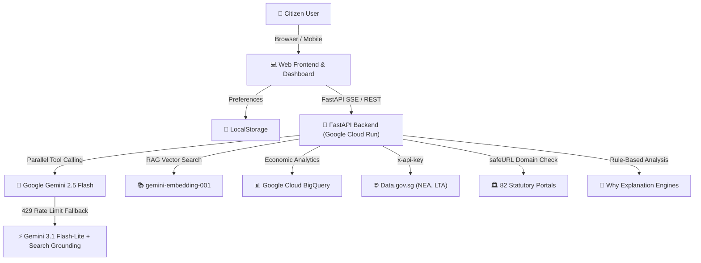

# 🇸🇬 MerlionOS: Unified Singapore Public Sector AI Coordination Brain
*APAC GenAI Academy (APAC Edition) — Cohort 2 Hackathon Project*

[](https://github.com/leshweyeewin/merlion-os/actions/workflows/ci.yml)

**🔗 Live Demo:** [merlion-os.onrender.com](https://merlion-os.onrender.com)  
**📝 Read the Dev Journey:** [Building MerlionOS (Blog Post)](https://blog.pancherry.com/merlion-os/)  
*(Hosted on Render. Singapore government sites — LTA DataMall, the HDB newsroom, MOM's wage
tables — WAF-block cloud datacenter IP ranges, and Google Cloud Run's egress falls inside those
blocks, so those live feeds 403 from GCP. Render's AWS-based egress isn't blocked, so all feeds
fetch live there. A Google Cloud Run backup deploy still exists (`deploy.yml`, manual-only) but
serves cached/seed fallbacks for the WAF-blocked sources.)*

---

## 🎯 What is MerlionOS & Why It Was Built

**MerlionOS** is a unified, secure, redirect-hardened Singapore public sector AI coordination brain and live dashboard. 

### The Problem
Singapore's digital public service landscape is highly advanced but fragmented across **82 distinct statutory boards and agencies** (CPF, IRAS, ELD, HDB, RedeemSG, GovBenefits, SkillsFuture, HealthHub, ActiveSG, and more). A resident transition to full citizenship exposes a massive spike in administrative complexity—moving from basic tax filing (IRAS) to checking electoral registers (ELD), claiming CDC voucher tranches (RedeemSG), checking cash benefits (GovBenefits), checking SkillsFuture credits, and navigating complex HDB BTO launches. Searching for these portal endpoints individually via search engines is inefficient, prone to malicious redirect hijacking, and lacks a centralized view.

### The Solution
MerlionOS aggregates this entire ecosystem into a single-pane-of-glass daily utility portal:
1. **Intelligent Co-Pilot**: Conversational agent that routes queries to 15 backend tools — including a retrieval-augmented civic knowledge base and multimodal document upload — to answer complex citizen questions, optionally tailored to a chosen demo persona.
2. **Live Data Dashboard (SG Hub)**: Consolidated parameters showing real-time MRT statuses (LTA DataMall), 2km taxi density map, air quality/weather forecasts (NEA API), BTO launches (HDB press releases), IRAS tax relief optimizer, and community deals.
3. **Operations Terminal**: Full transparency logs streaming raw SQL queries, crawler requests, and backend execution statuses in real time.

---

## 🏗️ Architecture & Process Flow


```mermaid
flowchart TD
    User["👤 Citizen User"] -->|Browser / Mobile| FE["💻 Web Frontend & Dashboard"]
    FE -->|Preferences| LocalStorage["💾 LocalStorage"]
    FE -->|FastAPI SSE / REST| API["🚀 FastAPI Backend (Google Cloud Run)"]

    API -->|Parallel Tool Calling| Gemini["🤖 Google Gemini 2.5 Flash"]
    API -->|RAG Vector Search| Embed["📚 gemini-embedding-001"]
    Gemini -->|429 Rate Limit Fallback| FlashLite["⚡ Gemini 3.1 Flash-Lite + Search Grounding"]

    API -->|Economic Analytics| BQ["📊 Google Cloud BigQuery"]
    API -->|x-api-key| DataGov["🌐 Data.gov.sg (NEA, LTA)"]
    API -->|safeURL Domain Check| GovPortals["🏛️ 82 Statutory Portals"]
    API -->|Rule-Based Analysis| WhyEngines["🎯 Why Explanation Engines"]
```

---

## 🚀 Key Technical Highlights

**🤖 AI & Agentic Core**
* **Primary Engine (Gemini 2.5 Flash):** The default high-speed reasoning core powering the agent.
* **Multi-Hop Reasoning:** The Co-Pilot orchestrates multi-turn reasoning loops—querying APIs, analyzing results, and deciding next steps before synthesizing a final answer.
* **Multimodal Vision:** Natively decodes uploaded images (e.g., photos of CPF statements or tax notices) via Gemini's vision channel for instant data extraction and analysis.
* **RAG Civic Knowledge Base:** Uses `gemini-embedding-001` and pure-Python cosine similarity over a curated civic corpus to accurately ground open-ended policy questions.
* **SSE Streaming:** Delivers real-time, token-by-token streaming responses with a dynamic typing cursor.

**🛡️ Security & Resilience**
* **PII Fast-Path & API Fallbacks:** A hardened heuristic safely fast-paths everyday queries, while trapping sensitive PII. If primary API quotas hit 429, it seamlessly falls back to `gemini-3.1-flash-lite` with Search Grounding.
* **Anti-Phishing Citations:** Clickable links are strictly enforced to trusted `.gov.sg` domains. Untrusted or authentication URLs (like SingPass) are neutralized into plain text.
* **Dynamic Rate Limiting:** An in-memory sliding window protects chat endpoints from abuse, scaling automatically for local dev vs. production.

**📊 Data Engineering & Analytics**
* **3-Tier WAF-Proof Datasets:** Heavy tabular data (HDB, Jobs) lives in BigQuery, degrading gracefully to live APIs, then to local disk snapshots if cloud egress is blocked.
* **Concurrent Fetches & Caching:** Dashboards load rapidly using `anyio` async task groups, structural dicts, and granular TTL response caching.
* **Rule-Based "Why" Explanations:** Deterministic algorithms calculate causal relationships (e.g., COE supply vs. demand) directly from data, eliminating AI hallucination risks.
* **Interactive Dashboards:** Live datasets power on-device predictive linear regression, real-time maps (Leaflet.js), and live transit/weather trackers.

**💻 Frontend & DevOps**
* **Operations Terminal:** A live-streaming debug console surfaces raw BigQuery SQL, crawler requests, and tool execution logs directly in the UI.
* **Intent-Based Routing & Glossary:** Search maps everyday phrasing to specific statutory services. A semantic engine automatically underlines civic jargon with plain-English tooltips.
* **Considered UX & Accessibility:** Fully responsive, keyboard-navigable ARIA tabs, skeleton loaders, and deterministic demo personas that tailor the dashboard layout.
* **Robust CI/CD:** Guarded by a **179-test suite (173 Python, 6 JS)**, pyflakes linting, and an hourly GitHub Action that refreshes fallback data seeds.

---

## 📑 Documentation Index

The repository's comprehensive guides are split into dedicated files inside [`docs/`](docs/) for modularity and clean maintenance:

| Topic | What's inside | File Link |
|---|---|---|
| 🏛️ **Statutory Portals Directory** | All **81** agency portals list, drag-and-drop ordering, and portal search/multi-select panels. | [docs/portals.md](docs/portals.md) |
| 📊 **Live Data Dashboard** | Detailed data sources and exact REST APIs for NEA weather, LTA transit, HDB listings, and Telegram feeds. | [docs/data_sources.md](docs/data_sources.md) |
| ⚖️ **IRAS Tax Relief Optimizer** | Progressive income tax brackets, CPF SA (RSTU) vs. SRS top-up optimization, itemised pre-existing reliefs (incl. life insurance), and the S$80k statutory relief cap. | [docs/iras_optimizer.md](docs/iras_optimizer.md) |
| 💻 **Local Setup & Quickstart** | Requirements, environment keys setup, Google Cloud BigQuery keys, and FastMCP daemon running instructions. | [docs/quickstart.md](docs/quickstart.md) |
| 🛡️ **Security & Performance** | Web scraping validation criteria, client-side escaping (`safeURL`), caching mechanisms, and GZip compression. | [docs/security_and_performance.md](docs/security_and_performance.md) |
| 📋 **Changelog** | Release notes and changes made in each version. | [docs/changelog.md](docs/changelog.md) |

---

## ⚡ Quick Start

For a detailed local setup walkthrough, Google BigQuery configuration, FastMCP agent tool servers, folder structure index, and troubleshooting, see the [Local Quickstart & Setup Guide](docs/quickstart.md).

### 1. Fast Setup
Copy `.env.example` to `.env` in the root folder and fill in your keys:
```env
GEMINI_API_KEY="YOUR_GEMINI_API_KEY"
LTA_DATAMALL_API_KEY="YOUR_LTA_DATAMALL_API_KEY"
```

### 2. Install & Run
Install core dependencies and start the uvicorn web server:
```bash
pip install -r requirements.txt
python server.py
```
Open **`http://127.0.0.1:8000/`** in your browser.

### 3. Run Tests
Ensure dependencies are installed, then run the lint gate and the python/javascript test suites (173 Python + 6 JavaScript tests):
```bash
pip install -r requirements-dev.txt
pyflakes server.py tools mcp_server.py tests
pytest tests/ -v
node --test tests/*.js
```

### 4. Build & Run Container (Docker)
```bash
docker build -t merlion-os .
docker run -p 8000:8000 --env-file .env merlion-os
```

