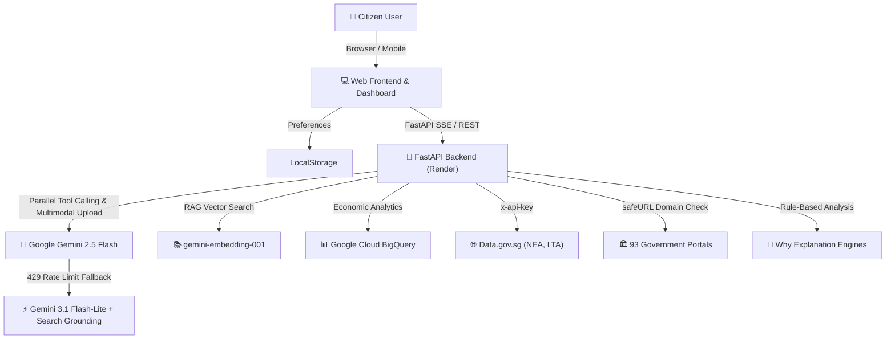
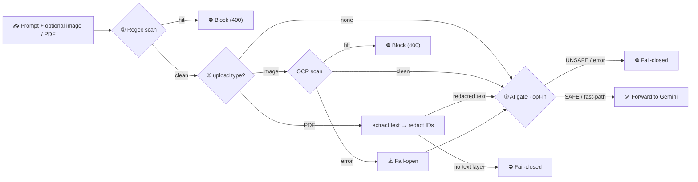
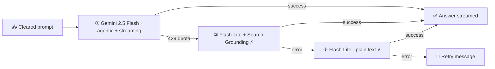

# 🏗️ MerlionOS System Architecture Diagram

This is the official system architecture diagram for **MerlionOS**, as published in the blog post and submission kit. It mirrors the diagram in the root [`README.md`](../README.md) — keep the two in sync.

## Component Summary
- **Frontend:** Static HTML/JS dashboard (`static/js/` modules) with local preferences in `localStorage`.
- **Backend:** FastAPI (`server.py`) running containerized on Render (Google Cloud Run retained as manual backup), with a dynamic per-IP rate limit (100/min local dev, 20/min production) on the chat endpoints.
- **AI Core:** Google Gemini 2.5 Flash with parallel tool calling, falling back to Gemini 3.1 Flash-Lite + Google Search Grounding on a 429.
- **Knowledge RAG Engine:** `gemini-embedding-001` (768-dim embeddings) over a 109-chunk civic corpus with government source URLs, retrieved via pure-Python cosine similarity, with a golden-set retrieval-quality test.
- **Data & Scraper Layer:** BigQuery aggregates (HDB Resale, MOM Job Vacancy, OWS) with a data.gov.sg CSV → disk-snapshot fallback; live JSON APIs (LTA, NEA, PUB); and domain-validated BeautifulSoup scrapers that block untrusted redirects and SingPass/auth pages.
- **Interop:** `mcp_server.py` exports the tool set over MCP JSON-RPC for external agents (Cursor / Claude).

---

## 🛡️ Privacy Guardrail Architecture (defense-in-depth, block-don't-redact)

Personal identifiers are stopped **before any bytes reach the LLM**. Detection is layered so no single check is a single point of failure, and each layer fails in the direction that does the least harm. Mirrored in the root [`README.md`](../README.md) — keep in sync.

- **Layer 1 — regex (`tools/security.py::scan_pii`):** Singapore NRIC/FIN, email, phone, a Luhn-gated credit-card detector, and SingPass credential phrases. Policy is **block (HTTP 400)**, not redact-and-forward.
- **Layer 2 — OCR / PDF processing (`scan_uploaded_image` / `tools/chat.py`):** For images, the same detectors run over `pytesseract` output; OCR failure **fails open** so a legitimate document isn't blocked by an OCR hiccup. For PDFs, text is extracted server-side and personal identifiers are deterministically redacted to `[REDACTED]` while preserving dollar figures; unreadable/scanned PDFs with no text layer **fail closed**.
- **Layer 3 — AI semantic gate (`server.py::check_text_safety_with_ai`):** Off by default (`ENABLE_AI_SAFETY_CLASSIFIER`), guarded by a local `is_obviously_safe` fast-path + cache, and **fail-closed** on error. It is deliberately opt-in because fail-closed behaviour would block harmless prompts during a primary-model 429.

## ⚡ AI Chat Failover Ladder (graceful degradation)

When the primary model is rate-limited, the chat loop steps down through simpler modes rather than failing (`tools/chat.py::run_chat_loop` / `run_chat_stream`). Mirrored in the root [`README.md`](../README.md).

- Tiers 2 and 3 append a visible **⚡ Fallback / Failover Mode** note so a reduced-path answer is never passed off as a full one.
- The ladder is implemented identically in the buffered and SSE-streaming paths; the final tier emits an empty token before the error so a chat bubble exists before the message renders.
