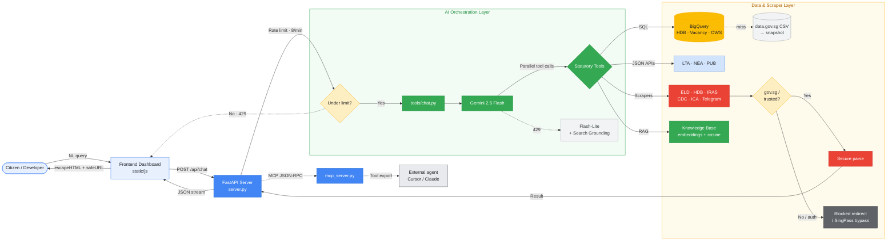

# 🏗️ MerlionOS System Architecture Diagram

This is the official system architecture diagram for **MerlionOS**, as published in the blog post and submission kit. It mirrors the diagram in the root [`README.md`](../README.md) — keep the two in sync.

## Component Summary
- **Frontend:** Static HTML/JS dashboard (`static/js/` modules) with local preferences in `localStorage`.
- **Backend:** FastAPI (`server.py`) running containerized on Render (Google Cloud Run retained as manual backup), with a per-IP rate limit (8/min) on the chat endpoints.
- **AI Core:** Google Gemini 2.5 Flash with parallel tool calling, falling back to Gemini 3.1 Flash-Lite + Google Search Grounding on a 429.
- **Knowledge RAG Engine:** `gemini-embedding-001` (768-dim embeddings) over a 42-chunk civic corpus with government source URLs, retrieved via pure-Python cosine similarity.
- **Data & Scraper Layer:** BigQuery aggregates (HDB Resale, MOM Job Vacancy, OWS) with a data.gov.sg CSV → disk-snapshot fallback; live JSON APIs (LTA, NEA, PUB); and domain-validated BeautifulSoup scrapers that block untrusted redirects and SingPass/auth pages.
- **Interop:** `mcp_server.py` exports the tool set over MCP JSON-RPC for external agents (Cursor / Claude).
