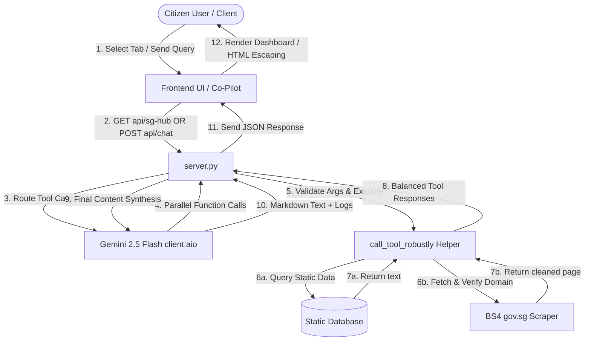

# 🇸🇬 MerlionOS Hack2skill Submission Kit
*APAC GenAI Academy (APAC Edition) — Cohort 2 Hackathon*

---

## 🧭 Challenge Track Selection Recommendation

### Selected Challenge: **AI for Better Living and Smarter Communities**
* **Why this is the perfect fit:** MerlionOS is designed as a unified public-sector data intelligence portal that directly solves public service navigation friction for Singapore citizens. It aggregates information from 15+ statutory boards (ICA, CPF, IRAS, MOM, ELD, etc.), performs real-time official page scraping, and compiles custom compliance briefs. By consolidating siloed portals into one conversational engine, it acts as a tool citizens would actually use to make faster, better-informed lifestyle and compliance decisions.

---

## 📝 Submission Brief Description
*Copy and paste this into the "Brief description" field on the submission form:*

> **MerlionOS** is a unified public sector AI coordination brain built for Singapore Citizens to navigate fragmented government portals and services.
> 
> Powered by **Google Gemini 2.5 Flash** (via the new `google-genai` SDK) and a dynamic web scraping pipeline, MerlionOS accepts complex, multi-intent queries and handles them programmatically. It searches an indexed directory of 15+ statutory boards and performs real-time BeautifulSoup4 scraping of official `.gov.sg` pages to extract transaction fees, deadline milestones, and eligibility rules.
> 
> The system features a premium glassmorphism dark slate UI side-by-side with a real-time **Operations Control Log** terminal. This terminal visualizes live under-the-hood traces of the AI's internal thoughts, search arguments, scraping previews, and function outputs, giving citizens complete transparency and confidence in how their customized guidance briefs were synthesized.

---

## 📊 Slides Presentation Deck Content (11 Slides)

### Slide 1: Title Slide (Participant Details)
*   **Project Name:** MerlionOS - Singapore Public Sector AI Coordination Brain
*   **Subtitle:** Empowering citizens with unified public service routing and real-time site scraping
*   **Participant Name:** [Your Name / Team Name]
*   **Problem Statement:** Singapore's public services are siloed across multiple independent statutory boards (ICA, ELD, IRAS, CPF, MOM, etc.). Citizens are forced to manually navigate numerous independent websites, resulting in search fatigue, missing critical compliance windows (like the 2-month Singapore Journey milestone), and transaction friction.

---

### Slide 2: Brief About the Idea
*   **Unified Access Layer:** A single conversational portal coordinating requests across 15+ agencies simultaneously.
*   **Dynamic Scraper Engine:** MerlionOS doesn't just link to websites; it dynamically fetches, sanitizes, and parses raw text from official `.gov.sg` domains to answer citizen queries on the spot.
*   **Operations Control Log:** A side-by-side terminal displaying live developer traces of the AI's internal calls, scraping statuses, and tool execution parameters, ensuring total transparency.

---

### Slide 3: Solution Approach & Google Cloud Stack
*   **Approach:** Built a stateless FastAPI web server that maps user queries to Python tool registries. Gemini 2.5 Flash handles orchestration via native parallel function calling. The entire toolset is also wrapped into a plug-and-play Model Context Protocol (MCP) server.
*   **Google Cloud / GenAI Stack:**
    *   **Google Gemini 2.5 Flash:** Low-latency inference model chosen for outstanding speed, high context window efficiency, and stable parallel tool use.
    *   **google-genai SDK:** Modern async API client library used to communicate with the model.
    *   **Model Context Protocol (FastMCP):** Integrated the open MCP standard to allow standard API tool interoperability.
    *   **Google BigQuery:** Leveraged as a data warehouse to query and store Singapore Ministry of Manpower (MOM) public employment statistics.
*   **Real-World Impact:** Zero-overhead decision support. Instead of opening 4 different portal tabs to verify citizenship milestones, tax reliefs, and voting registers, a citizen gets a single synthesized, scan-ready guide in 3 seconds.

---

### Slide 4: Opportunities, USP & Key Differentiators
*   **Key Differences:**
    *   *Traditional Portals:* Passive FAQ directories with external link lists.
    *   *MerlionOS:* Active, agentic assistant that reads, scrapes, and aggregates official pages on the fly, with standard integrations.
*   **Unique Selling Proposition (USP):**
    *   **1. Dual-Operational Model (Web UI + MCP Server):** Serves end-users via a premium dashboard and developers/enterprises as a standardized Model Context Protocol (MCP) tool server.
    *   **2. Zero-Trust Transparency:** Exposes raw model inputs and scraper outputs in the live UI Operations Log, boosting trust in AI-generated advice.
    *   **3. Dynamic Redirect Validation:** Scraper follows redirects but strictly verifies that the final landing page is a `.gov.sg` domain, preventing domain hijacking.
    *   **4. Robust Argument Matching:** A signature-inspecting execution helper resolves parameter drifts and mismatched arguments, preventing API failures.

---

### Slide 5: List of Features Offered
1.  **Multi-Intent Parallel Routing:** Handles multi-domain queries in a single turn, triggering multiple backend tools concurrently (e.g. CPF ledgers + IRAS tax rules + Singapore Journey).
2.  **Live .gov.sg Web Scraper:** Autonomous crawler clean-up of script/style tags to extract raw text up to 6000 characters from official web portals.
3.  **Real-Time Operations Log:** Live display of tool parameters, arguments, extraction metrics, and response execution.
4.  **XSS & Link Hardening:** Double-escaping of user/model variables before HTML rendering and automatic filtering of malicious `javascript:` or `data:` links.
5.  **Multi-turn Conversation Memory:** Client-side stateless history arrays fed into Gemini's context window, allowing conversational follow-ups.
6.  **FastMCP Tool Exporter:** Fully-integrated `mcp_server.py` that lets the toolset connect directly to standard clients like Cursor or Claude Desktop.
7.  **BigQuery Job Analytics:** Direct SQL queries to BigQuery-partitioned employment tables to retrieve live vacancy counts, salaries, and sector demand trends.

---

### Slide 6: Process Flow Diagram
```text
[Citizen Query] ──> [Frontend Chat UI (app.js)] OR [MCP Client (Cursor/Claude)]
                           │                               │
                           ▼                               ▼
              [FastAPI Server (server.py)]    [mcp_server.py (FastMCP)]
                           │                               │
                           └───────────────┬───────────────┘
                                           │
                                           ▼
                             [Gemini 2.5 Flash Orchestrator]
                              (Analyzes intents & matches tools)
                             /               |                 \
                            ▼                ▼                  ▼
                    [Static db tool]  [Gov Directory]   [gov.sg Scraper]
                    (IRAS, ICA, CPF)   (ELD, HDB, MOE)   (BeautifulSoup4)
                            \                |                  /
                             ▼               ▼                 ▼
                        [call_tool_robustly Helper maps arguments]
                                           │  (Runs in non-blocking Threadpool)
                                           ▼
                             [Final Response Compiled]
                                           │
                                           ▼
                   [Renders markdown / returns JSON to client]
```

---

### Slide 7: Wireframes / Mock Diagrams
*   **Main Dashboard Layout:** Split into a tabbed main viewer and a floating conversational assistant.
    *   **Main Tab Switcher:**
        *   **Tab 1 - SG Portals:** Standard drag-and-drop grid of 12+ statutory agency cards (reorderable and persisted in localStorage).
        *   **Tab 2 - SG Hub:** Live dashboard containing sub-panels for weather & PSI indices, crawled Telegram developer events, and interactive BigQuery job vacancy charts.
    *   **Floating Co-Pilot Panel:**
        *   **Assistant Tab:** Conversational interface with suggestion chips and Markdown responses.
        *   **Operations Trace Tab:** Interactive command-line console logs showing live tool arguments.

---

### Slide 8: Architecture Diagram


---

### Slide 9: Technologies Used & Scalability
*   **Core AI Engine:** Google Gemini 2.5 Flash (`google-genai` SDK) - Selected for low latency, low token costs, and highly stable tool calling.
*   **Asynchronous Backend:** FastAPI & Uvicorn - Utilizes an async event loop with `anyio.to_thread.run_sync` to run blocking scraping requests in a separate thread pool. This preserves event loop concurrency under heavy traffic.
*   **Data Warehouse & Analytics:** Google BigQuery - Handles ingestion and fast execution of analytic queries on public employment data, partitioned by sector tables.
*   **Interoperability Standard:** FastMCP (`mcp` library) - Seamlessly translates local python database and scraper functions into standardized MCP JSON-RPC schemas.
*   **Clean Scraping Pipeline:** BeautifulSoup4 & requests - Follows redirects safely and extracts body elements while stripping scripts, stylesheet headers, and footers.
*   **Secure Client-Side Rendering:** Vanilla JavaScript and CSS - Zero framework overhead, highly secure, fast loading, and responsive.

---

### Slide 10: Snapshots of the Prototype
*Refer to the local WebP demo recordings generated in the workspace:*
1.  **Chatbot UI & Agency Routing Demonstration:** Shows parallel tool routing, typing status animation, and structural layout response.
    *   *Path:* [chatbot_web_ui_test_1783157343084.webp](file:///C:/Users/LESHW/.gemini/antigravity-ide/brain/0cc9685e-7ef3-4616-9458-fcd5212cf083/chatbot_web_ui_test_1783157343084.webp)
2.  **Live .gov.sg Web Scraper Demonstration:** Shows inputting a custom `.gov.sg` URL, real-time scraping logs, and synthesis.
    *   *Path:* [chatbot_scrape_test_1783157476114.webp](file:///C:/Users/LESHW/.gemini/antigravity-ide/brain/0cc9685e-7ef3-4616-9458-fcd5212cf083/chatbot_scrape_test_1783157476114.webp)

---

### Slide 11: Thank You
*   **MerlionOS — Singapore Public Sector AI Coordination Brain**
*   *Unified, Transparent, and Secure.*
*   **GitHub Repository:** [Your Repo Link]
*   **Public Live Demo:** [Your Render Live URL]
