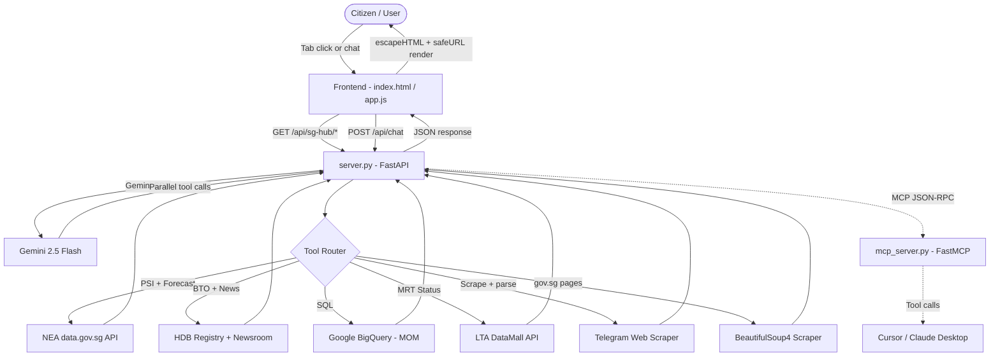

# 🇸🇬 MerlionOS Hackathon Submission Kit
*APAC GenAI Academy (APAC Edition) — Cohort 2 Hackathon*
*Version 2.0 — Updated July 2026*

---

## 🧭 Challenge Track

### Selected: **AI for Better Living and Smarter Communities**

**Why this track fits perfectly:**
MerlionOS is a unified public-sector data coordination portal designed to simplify access to fragmented government resources. Developed from a personal user journey of becoming a Singapore citizen, it aggregates live data from **15 statutory board portals** (ICA, ELD, IRAS, CPF, MOM, MOH, HDB, MOE, LTA, NEA, RedeemSG, SP Group, MySkillsFuture, Gov.sg, and WSG/SWDA), performs redirect-safe BeautifulSoup4 scraping, and exposes a live civic dashboard with LTA and NEA metrics. It addresses daily resident friction by unifying information retrieval under a single conversational brain.

---

## 📝 Submission Brief Description
*Copy and paste into the "Brief description" field:*

> **MerlionOS** is a unified, redirect-hardened Singapore public sector AI coordination brain and live dashboard. Inspired by a developer's transition to citizenship—moving from simple CPF/IRAS checks to managing ELD registers, HDB launches, SkillsFuture learning credits, and RedeemSG CDC tranches—it acts as a one-stop utility portal.
>
> Powered by **Google Gemini 2.5 Flash** with native parallel tool calls, the Co-Pilot routes queries to 10+ backend tools, queries partitioned **Google BigQuery** employment databases, and scrapes official pages securely. It handles redirects safely by restricting scraped endpoints to `.gov.sg` and trusted domains (`healthhub.sg`, `wsg.sg`, `cdc.gov.sg`), blocking authentication logins.
>
> The **SG Hub Live Dashboard** consolidates critical daily parameters: a live **Transit Status Grid** (LTA DataMall API) for line-by-line MRT status, rain and air quality metrics (NEA API), upcoming BTO launches with date badges (HDB Newsroom Next.js script extraction), and date-sorted Telegram updates. An **Operations Terminal** prints live SQL queries and crawler traces for full transparency.

---

## 📊 Presentation Deck (11 Slides)

### Slide 1: Title Slide
- **Project Name:** MerlionOS — Singapore Public Sector AI Coordination Brain
- **Subtitle:** One-stop citizen coordination, live transit monitoring, and agentic AI
- **Track:** AI for Better Living and Smarter Communities
- **Intent Story:** As a resident, I only accessed CPF, IRAS, and HealthHub. Becoming a citizen meant dealing with 15+ statutory boards (ELD, HDB, RedeemSG, SkillsFuture) scattered across Google searches. I built MerlionOS to aggregate this complexity into one dashboard, adding live transit and job market metrics crucial to my daily working life.

---

### Slide 2: The Problem & Opportunity

| Pain Point | Impact |
|---|---|
| 15+ scattered government portals | Citizens waste time search-indexing bookmarks |
| Post-citizenship complexity | Compulsory voting, BTO launches, voucher tranches are scattered |
| Transport & job vulnerability | No consolidated feed for MRT delays & employment trends |
| Untrusted/Hijacked redirects | Scraping FAQ pages is vulnerable to phishing/auth leaks |
| Black-box AI | Users cannot verify query-to-database routing |

**Opportunity:** A unified coordination dashboard combining statutory registries, live APIs, and sanitised scraping with full operations transparency.

---

### Slide 3: Solution Approach & Google Stack

**Approach:** A stateless FastAPI server maps citizen inquiries to registered Python tools. Gemini 2.5 Flash acts as the coordinator, calling tools in parallel. Weather, rail alerts, housing press releases, and job trends are retrieved on-demand and validated securely before UI rendering.

**Google Technologies Used:**
- **Google Gemini 2.5 Flash** — Orchestration agent with native parallel tool calls
- **google_genai SDK** — High-performance async model interface
- **Google Search Grounding Fallback** — Automatic failover to `gemini-2.0-flash` with search grounding on 429 quota limits to guarantee 100% uptime
- **Google BigQuery** — Analyzes MOM employment datasets partitioned by sector (Tech, Finance, Healthcare, General)
- **Model Context Protocol (FastMCP)** — Exposes tools for Cursor/Claude Desktop

---

### Slide 4: Key Differentiators

| Feature | Traditional Portals / search | MerlionOS |
|---|---|---|
| Aggregation | Search portals one-by-one | One-stop directory of 15 statutory boards |
| AI Search Uptime | Quota error block | Google Search Grounding fallback |
| Air Quality/Weather | Separate NEA site | Live PSI gauge + 6-region forecast cards |
| Rail Alerts | Check multiple channels | LTA DataMall API line-by-line grid (EWL/NSL/NEL/DTL/etc) |
| Job statistics | Separate MOM portal | Partitioned BigQuery MOM dataset |
| Link Safety | Redirects vulnerable to hijack | BeautifulSoup redirect validation + safeURL XSS sanitization |

---

### Slide 5: Feature List (v2.0)

1. **🤖 Multi-Intent Coordinator** — Gemini 2.5 Flash calls multiple statutory tools concurrently
2. **🌤️ Weather Station** — Live PSI gauge + 6-region emoji forecast cards (NEA API)
3. **🚇 Transit Operations Grid** — Real-time MRT/LRT line statuses, disruption details, and bus bridge info (LTA DataMall API)
4. **🏢 BTO Launch Tracker** — Availability tables with date badges (HDB Newsroom Next.js script extraction)
5. **📊 Job Market Analytics** — Tech/Finance/Healthcare/General sector statistics (Google BigQuery)
6. **⚠️ MOM Retrenchment Index** — Active figures with "Data as of: Q1 2026" date badge
7. **📢 Gov Updates:** Last 3 posts from 7 official Telegram channels, chronologically sorted by SGT date
8. **🎟️ Kiasu Deals:** Lifestyle deals from the last 24 hours (15 Telegram channels)
9. **🌐 15 Statutory Portals** — Drag-and-drop persistent cards (ELD, ICA, IRAS, CPF, MOM, MOH, HDB, MOE, LTA, NEA, etc.)
10. **🖥️ Operations Terminal** — Live logging of SQL queries, crawler requests, and scraper HTTP responses
11. **🔐 safeURL Sanitization** — Client-side HTML cleanup blocking `javascript:`/`data:` links & escaping quotes
12. **🔒 Scraper Hardening** — Restricts scraping to `.gov.sg`, `healthhub.sg`, `wsg.sg`, `cdc.gov.sg` and blocks auth endpoints

---

### Slide 6: Process Flow

```text
[Citizen Query / Tab Click]
        │
        ▼
[FastAPI Server (server.py)]
        │
        ├──► On-demand Hub APIs:
        │       • GET /api/sg-hub/weather      → NEA PSI + 2-hr forecast
        │       • GET /api/sg-hub/hdb          → BTO registry + HDB pulse
        │       • GET /api/sg-hub/jobs         → BigQuery MOM dataset
        │       • GET /api/sg-hub/gov-transit  → Telegram gov channels + LTA DataMall Train Alerts
        │       • GET /api/sg-hub/community    → Telegram community channels (last 24h)
        │
        └──► Chat API:
                POST /api/chat
                        │
                        ▼
              [Gemini 2.5 Flash Orchestrator]
              (429 Fallback: Gemini 2.0 + Search Grounding)
              /           |           \
             ▼            ▼            ▼
       [Static DB]  [Gov Scraper]  [BigQuery]
       15 statutory BeautifulSoup4  MOM data
             \            |            /
              ▼            ▼           ▼
          [call_tool_robustly — arg mapping helper]
                        │
                        ▼
              [Synthesized Markdown Response]
                        │
                        ▼
          [Frontend: safeURL → escapeHTML render]
```

---

### Slide 7: SG Hub Dashboard Layout

```
┌─────────────────────────────────────────────────────┐
│  SG Hub        [Weather][HDB][Jobs][Gov][Community]  │
├─────────────────────────────────────────────────────┤
│  🕒 Last synced: 05 Jul 2026, 06:48 PM (SGT)        │
│                                                      │
│  ┌── LTA DataMall Train Status ──────────────────┐  │
│  │ EWL 🟢 Normal   NSL 🟢 Normal   NEL 🟢 Normal    │  │
│  │ CCL 🟢 Normal   DTL 🟢 Normal   TEL 🟢 Normal    │  │
│  └──────────────────────────────────────────────┘  │
│                                                      │
│  ⚠️ Official Advisory (2026-04-18 11:50)             │
│  ┌──────────────────────────────────────────────┐  │
│  │ Sengkang West LRT Inner Loop Closed...       │  │
│  └──────────────────────────────────────────────┘  │
└─────────────────────────────────────────────────────┘
```

---

### Slide 8: Architecture Diagram



---

### Slide 9: Technology Stack & Scalability

| Component | Technology | Why |
|---|---|---|
| AI Engine | Gemini 2.5 Flash | Fast orchestrator, high context, stable parallel tool calling |
| Fallback Engine | Gemini 2.0 Flash | Search Grounding fallback on 429 quota exhaustion |
| Backend | FastAPI + Uvicorn | Async event loop; `anyio.to_thread` for non-blocking I/O |
| Data Warehouse | Google BigQuery | Scalable analytical storage for MOM employment datasets |
| Live APIs | NEA & LTA DataMall | Structured weather and train service alerts |
| HTML Parser | BeautifulSoup4 | Re-validates redirected domains and filters auth endpoints |
| Frontend | Vanilla JS (safeURL) | Sandbox sanitization, localStorage grid reordering |

---

### Slide 10: Demo Highlights

**Operations Terminal traces visible during demo:**
```
[MerlionOS Orchestrator] --- Fetching Gov Updates & Transit Feeds Selected ---
[Telegram Scraper Service] Spawning parallel crawler tasks in an anyio TaskGroup...
  [LTA DataMall] Running in parallel with Telegram scrapers...
  [LTA DataMall] HTTP GET https://datamall2.mytransport.sg/ltaodataservice/TrainServiceAlerts
  [LTA DataMall] HTTP RESPONSE: 200
  ✔ [LTA DataMall] Overall status: Normal (1). 0 segment(s) affected, 1 message(s) retrieved.
```

**UI Features to highlight:**
- Live MRT/LRT grid showing 🟢/🔴 status with Sengkang LRT closure warning alert card
- PSI animated gauge progress bar + regional forecast emoji cards (live NEA data)
- HDB BTO registry with launch date badges + HDB Newsroom Next.js scraper links
- MOM retrenchment Q1 2026 data freshness index
- Real-time tool query logs and SQL statements on the Operations Console
- safeURL XSS block warnings and redirected domain validation logs

---

### Slide 11: Thank You

**MerlionOS — Singapore Public Sector AI Coordination Brain**
*Unified. Hardened. Transparent.*

*Built with Google Gemini 2.5 Flash, BigQuery, FastAPI, FastMCP, and ❤️ for Singapore.*
