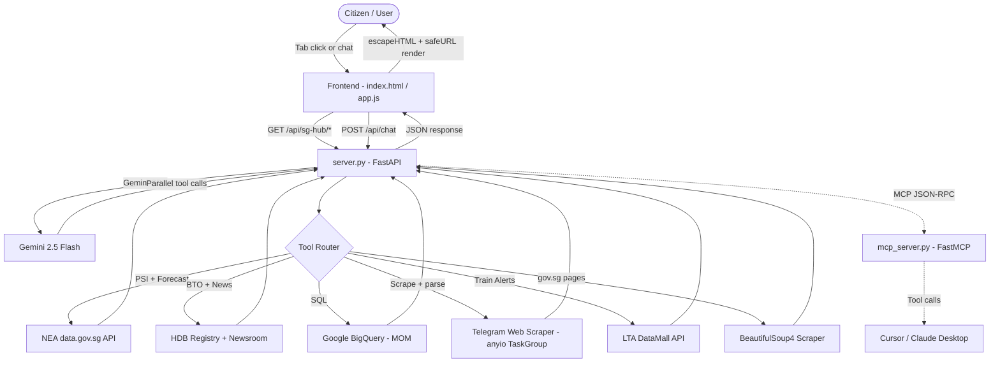

# 🇸🇬 MerlionOS Hackathon Submission Kit
*APAC GenAI Academy (APAC Edition) — Cohort 2 Hackathon*
*Version 2.0 — Updated July 2026*

---

## 🧭 Challenge Track

### Selected: **AI for Better Living and Smarter Communities**

**Why this track fits perfectly:**
MerlionOS is a unified public-sector data intelligence portal that directly solves public service navigation friction for Singapore citizens. It aggregates live data from 15+ statutory boards (ICA, CPF, IRAS, MOM, HDB, NEA, ELD, WSG, SWDA, MAS, etc.), performs real-time official page scraping, and surfaces a live civic dashboard — all through a single conversational AI engine. Citizens no longer need to visit multiple fragmented portals; MerlionOS does the navigation, retrieval, and synthesis for them.

---

## 📝 Submission Brief Description
> **MerlionOS** is a unified public sector AI coordination brain built for Singapore Citizens to navigate fragmented government portals and access live civic data in one place.
>
> Powered by **Google Gemini 2.5 Flash** and a real-time data pipeline, MerlionOS accepts complex multi-intent queries and routes them through 10+ backend tools concurrently. It searches an indexed directory of 15+ statutory boards, performs live BeautifulSoup4 scraping of trusted `.gov.sg` pages, queries **Google BigQuery** employment databases, and surfaces live weather/PSI metrics from the NEA data.gov.sg API.
>
> The **SG Hub Live Dashboard** features a visual weather station (PSI gauge + 6-region forecast cards), HDB BTO listings with launch dates, MOM job market analysis, and a live **Transit Status Grid** integrated directly with the official **LTA DataMall API** (displaying real-time line-by-line EWL/NSL/NEL/CCL/DTL/TEL MRT status, disruption details, and free bus shuttle routing).
>
> A real-time **Operations Control Log** terminal visualizes live traces: BigQuery SQL queries, HTTP scraping responses, LTA DataMall API requests, and API call chains — giving full transparency into AI operations for demo purposes.

---

## 📊 Presentation Deck (11 Slides)

### Slide 1: Title Slide
- **Project Name:** MerlionOS — Singapore Public Sector AI Coordination Brain
- **Subtitle:** Live civic data + agentic AI for smarter citizen decision-making
- **Track:** AI for Better Living and Smarter Communities
- **Problem:** Singapore public services span 15+ independent portals. Citizens manually navigate ICA, CPF, IRAS, HDB, MOM, NEA separately — wasting time, missing deadlines, and struggling with policy complexity.

---

### Slide 2: The Problem & Opportunity

| Pain Point | Impact |
|---|---|
| 15+ siloed government portals | Citizens waste hours cross-referencing |
| Static FAQ pages | No personalized, context-aware answers |
| No unified data view | Can't see weather + jobs + housing together |
| Fragmented Telegram feeds | Alerts scattered across many channels |
| No transparency in AI advice | Citizens distrust AI-generated guidance |

**Opportunity:** One intelligent portal that aggregates, scrapes, and explains — with full transparency.

---

### Slide 3: Solution Approach & Google Stack

**Approach:** A stateless FastAPI server maps citizen queries to Python tool registries. Gemini 2.5 Flash orchestrates parallel function calling. Data is retrieved on-demand from live APIs, BigQuery, web scrapers, and Telegram feeds — then rendered in a premium dark-mode dashboard.

**Google Technologies Used:**
- **Google Gemini 2.5 Flash** — Low-latency AI orchestration with native parallel tool calling
- **google-genai SDK** — Modern async model client
- **Google BigQuery** — Queries MOM employment statistics partitioned by sector (Tech, Finance, Healthcare, General)
- **Model Context Protocol (FastMCP)** — Exposes all tools as standard JSON-RPC endpoints for Cursor/Claude Desktop

**Proven Impact:** Instead of opening 4+ portal tabs, a citizen gets a synthesized guidance brief in under 5 seconds.

---

### Slide 4: Key Differentiators

| Feature | Traditional Portals | MerlionOS |
|---|---|---|
| Data access | Static FAQ links | Live API + scraper + BigQuery |
| Query handling | Keyword search | Multi-intent AI routing |
| Weather data | Separate NEA site | Live PSI gauge + forecast cards |
| Job market | Separate MOM site | BigQuery-powered sector analytics |
| Transit alerts | Scattered Telegram channels | **LTA DataMall API** (Structured line-by-line status) |
| HDB info | Separate HDB site + portal | BTO cards with dates + portal link |
| AI transparency | None | Live Operations Terminal |
| Data freshness | Unknown | "Last synced" timestamp on all panels |

---

### Slide 5: Feature List (v2.0)

1. **🤖 Multi-Intent Parallel AI Routing** — Single query triggers 5+ tools simultaneously
2. **🌤️ Weather Dashboard** — PSI gauge card with animated bar + 6-region emoji forecast cards (live NEA API)
3. **🏢 HDB BTO Tracker** — BTO availability cards with launch date badges + scraped press releases
4. **📊 BigQuery Job Analytics** — Tech/Finance/Healthcare/General sector breakdown; vacancies, salaries, skills, retrenchment risk
5. **🚇 LTA DataMall Train Status** — Structured MRT/LRT line grid (EWL, NSL, NEL, DTL, CCL, TEL) showing 🟢/🔴 status with free bus shuttle locations and official advisory notes (Status 1/2 mapping)
6. **📢 Gov Updates:** 7 official channels (govsg, HealthHub, ScamShield, MOE, NEA, GovTech, LTA) — last 3 posts per channel regardless of age, sorted newest-first, SGT timestamps shown
7. **🎟️ Kiasu SG Deals:** 15 lifestyle channels — posts within the last 24 hours, sorted newest-first, SGT timestamps & SGT date badges shown
8. **🕒 Data Freshness Indicators** — "Last synced: DD MMM YYYY, HH:MM (SGT)" on every sub-panel
9. **🌐 Gov Portals Directory** — 12+ agency cards including SWDA, with direct portal buttons
10. **🖥️ Operations Control Terminal** — Live SQL, HTTP, scraping traces for full transparency
11. **🔌 FastMCP Server** — Plug-and-play MCP tool server for Cursor/Claude Desktop
12. **🔐 URL Hardening (safeURL)** — Client-side HTML sanitation blocking `javascript:`/`data:` links & escaping quotes
13. **🔒 Redirection Security** — BeautifulSoup scraper re-validates landing domain to only allow `.gov.sg` or trusted domains (`healthhub.sg`, `wsg.sg`, `cdc.gov.sg`) and blocks authentication endpoints.

---

### Slide 6: Process Flow

```text
[Citizen Query / Tab Click]
        │
        ▼
[FastAPI Server (server.py)]
        │
        ├──► On-demand sub-panel APIs:
        │       • GET /api/sg-hub/weather      → NEA PSI + 2-hr forecast
        │       • GET /api/sg-hub/hdb          → BTO registry + HDB newsroom
        │       • GET /api/sg-hub/jobs         → BigQuery MOM dataset
        │       • GET /api/sg-hub/gov-transit  → Telegram gov channels + LTA DataMall API (parallel)
        │       • GET /api/sg-hub/community    → Telegram community channels (sorted)
        │
        └──► Chat API:
                POST /api/chat
                        │
                        ▼
              [Gemini 2.5 Flash Orchestrator]
              (Parallel function calling)
              /           |           \
             ▼            ▼            ▼
      [Static DB]  [Gov Scraper]  [BigQuery]
      ICA/CPF/IRAS  BeautifulSoup4   MOM data
             \            |            /
              ▼            ▼           ▼
         [call_tool_robustly — arg mapping helper]
                        │
                        ▼
              [Synthesized Markdown Response]
                        │
                        ▼
         [Frontend: escapeHTML → safe render]
         [Operations Log: trace display]
```

---

### Slide 7: SG Hub Dashboard Layout

```
┌─────────────────────────────────────────────────────┐
│  SG Hub        [Weather][HDB][Jobs][Gov][Community]  │
├─────────────────────────────────────────────────────┤
│  🕒 Last synced: 05 Jul 2026, 04:47 AM (SGT)        │
│                                                      │
│  ┌── PSI Gauge ──────────────────────────────────┐  │
│  │  🍃 28   [████░░░░░░░░░░░░░░]  ✅ Good        │  │
│  └──────────────────────────────────────────────┘  │
│                                                      │
│  ⛅ 2-Hr Regional Forecast                           │
│  ┌──────┐ ┌──────┐ ┌──────┐ ┌──────┐ ┌──────┐     │
│  │  ⛅  │ │  ☀️  │ │ 🌧️  │ │  ☁️ │ │ ⛈️  │     │
│  │Orchard│ │Jurong│ │Tampines│ │Woodl│ │Punggol│    │
│  └──────┘ └──────┘ └──────┘ └──────┘ └──────┘     │
└─────────────────────────────────────────────────────┘
```

---

### Slide 8: Architecture Diagram



---

### Slide 9: Technology Stack & Scalability

| Component | Technology | Why |
|---|---|---|
| AI Engine | Gemini 2.5 Flash | Low latency, high context, stable parallel tool calling |
| Backend | FastAPI + Uvicorn | Async event loop; `anyio.to_thread` for non-blocking I/O |
| Data Warehouse | Google BigQuery | Fast analytic queries on MOM employment data |
| Live APIs | NEA data.gov.sg | Real-time PSI + 2-hr forecast JSON |
| Feed Scraper | BeautifulSoup4 + anyio TaskGroup | Parallel Telegram channel crawlers |
| MCP Protocol | FastMCP | Standard JSON-RPC interoperability |
| Frontend | Vanilla HTML/CSS/JS | Zero-overhead, XSS-safe, fast |

**Scalability path:** BigQuery naturally scales to handle full MOM public employment datasets. The Telegram scraper uses parallel `anyio` task groups — easily extended to more channels. The FastAPI backend is stateless and horizontally scalable on Render/Cloud Run.

---

**Operations Terminal traces visible during demo:**
```
[MerlionOS Orchestrator] --- Fetching Gov Updates & Transit Feeds Selected ---
[Telegram Scraper Service] Spawning parallel crawler tasks in an anyio TaskGroup...
  [LTA DataMall] Running in parallel with Telegram scrapers...
  [LTA DataMall] HTTP GET https://datamall2.mytransport.sg/ltaodataservice/TrainServiceAlerts
  [LTA DataMall] HTTP RESPONSE: 200
  ✔ [LTA DataMall] Overall status: Normal (1). 0 segment(s) affected, 1 message(s) retrieved.
```

**UI Features to highlight:**
- Live MRT/LRT line grid (EWL, NSL, NEL, CCL, DTL, TEL) with colour-coded status badges
- Sengkang LRT planned loop closure warning advisory banner at the top of the Transit card
- PSI animated gauge with colour-coded threshold bar (live NEA data)
- Regional forecast emoji cards (live NEA data)
- HDB BTO cards with `📅 June 2026 Launch` date badges
- HDB news releases live scraper with SGT dates and real embedded links
- MOM retrenchment "Data as of: Q1 2026" date badge
- safeURL client-side XSS sanitization of all scraped links
- Redirect domain validation block traces for scraper security

---

### Slide 11: Thank You

**MerlionOS — Singapore Public Sector AI Coordination Brain**
*Unified. Transparent. Always Fresh.*

- 🔗 **GitHub:** [Your Repository URL]
- 🌐 **Live Demo:** [Your Render / Cloud Run URL]
- 📧 **Contact:** [Your Email]

*Built with Google Gemini 2.5 Flash, BigQuery, FastAPI, FastMCP, and ❤️ for Singapore.*
